# CE103 Algorithms and Programming-I Course Notes

### Week-1

#### Introduction and Developer Roadmap

Download [DOC](ce103-week-1-intro.en.md_doc.pdf), [SLIDE](ce103-week-1-intro.en.md_slide.pdf), [PPTX](ce103-week-1-intro.en.md_slide.pptx)

<iframe width=700, height=500 frameBorder=0 src="../ce103-week-1-intro.en.md_slide.html"></iframe>

---

### Outline

- Computer Engineering Roles
- Developer Roadmaps
- Building a Social Profile and Resume
- Job Qualifications 
- Using Google
- Operating Systems 
- Introduction to Internet (IP, Port etc.)
- Windows Helper Utilities
- Shortcuts 
- Command-Line Interface and Usefull Commands

---

### Brief Description of Course and Rules

We will first talk about, 

1. Course Plan and Communication

2. Grading System, Homework,s and Exams

please read the syllabus carefully. 

---

### Computer Engineering Roles

- Software Development

- Hardware Development

- Network Organization and Management

- Database Organization and Management

- Hardware and Software Testing

- Audit (Cyber Security, Policy etc.)

- Etc.

---

<!-- paginate: true -->

### Computer Engineering Areas

- Computer Vision

- Social

- Analytics 

- Mobility

---

- IoT

- Security

- Web-Scale IT

- Cloud

---

- Smart Machines

- Pervasive

- Fintech

- Etc.

---

### Our focus is Software Development

for this reason, we will focus on software-based road-maps

we can use common developer road maps from

https://roadmap.sh/

---

### What will you see in the roadmap?

- [Frontend Developer Roadmap: Learn to become a modern frontend developer](https://roadmap.sh/frontend)

- [Backend Developer Roadmap: Learn to become a modern backend developer](https://roadmap.sh/backend)

- [DevOps Roadmap: Learn to become a DevOps Engineer or SRE](https://roadmap.sh/devops)

- [DBA Roadmap: Learn to become a database administrator with PostgreSQL](https://roadmap.sh/postgresql-dba)

and [more](https://roadmap.sh/)

---

### Open a formal e-mail account

name.surname@gmail.com

n.surname@gmail.com

surname.name@gmail.com

namesurname@gmail.com

etc. do not have numbers in your e-mail adress

---

### Social Media and Job Search Profiles

- Open the following accounts
  
  - Linkedin
  
  - Gitlab
  
  - Bitbucket
  
  - Docker
  
  - Github
  
  - ORCID
  
  - ARBİS
  
  - Hackerrank
  
  - Publons

---

### Social Media and Job Search Profiles

- Open the following accounts
  
  - [https://www.kariyer.net/](https://www.kariyer.net/)
  
  - [https://www.yenibiris.com/](https://www.yenibiris.com/)
  
  - [https://www.secretcv.com/](https://www.secretcv.com/)

and more...

---

### Also, you need soft skills

- Excellent written and oral communication skills, including public speaking and presenting
- Decisiveness under pressure and strong critical thinking skills
- Willingness to work off-core-hours, when necessary, to deploy software or upgrade hardware

---

### If you need more information about your profession

Visit Job Search Web Portals and Look at Requirements to Understand What is Real Life Need

- https://www.kariyer.net/

- https://www.yenibiris.com/

- https://www.secretcv.com/

- https://www.linkedin.com/

- Etc.

---

### Using Google

- Google Scholar

- Google Patents

- Google Images

---

### Operating System List


---

### Operating System Architecture

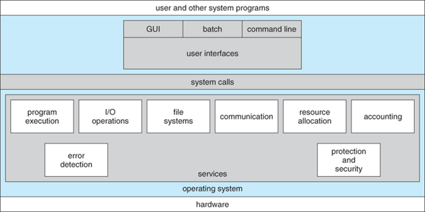

[reference](https://www.cs.uic.edu/~jbell/CourseNotes/OperatingSystems/2_Structures.html)

---

### Operating Systems Key Comparing Factor


[reference](https://www.slideshare.net/quanhan503/comparing-windows-vs-mac-vs-linux)

---

### Operating System Comparisons


[reference](https://www.educba.com/linux-vs-mac-vs-windows/)

---

#### Operating System Comparisons

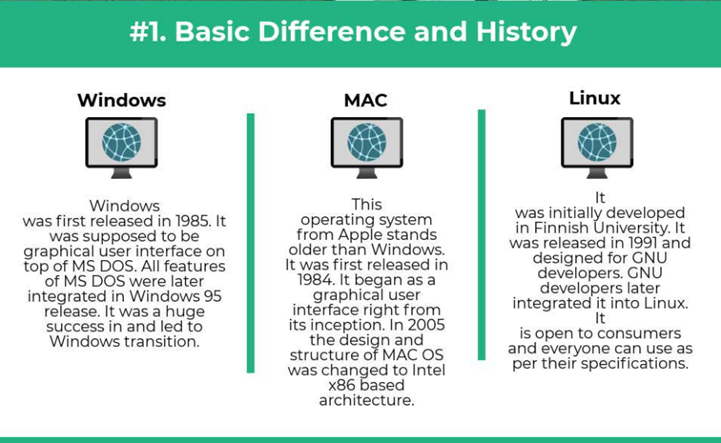

---

#### Operating System Comparisons

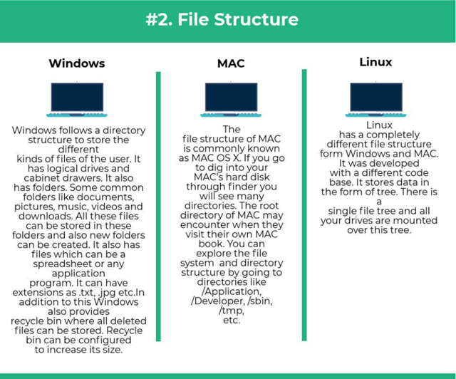

---

#### Operating System Comparisons


---

#### Operating System Comparisons


---

#### Operating System Comparisons


---

### **Intro to the Internet**

---

#### What is IP Address?

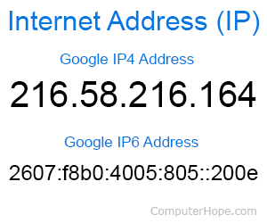

---

#### What is IP Address?

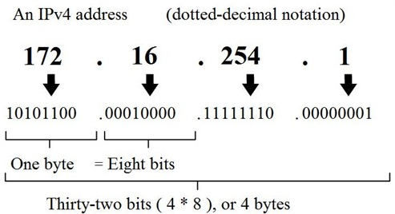

---

#### What is IP Address?


---

#### What is Port?

In [computer networking](https://en.wikipedia.org/wiki/Computer_networking), a port is a communication endpoint. At the software level, within an [operating system](https://en.wikipedia.org/wiki/Operating_system), a port is a logical construct that identifies a specific [process](https://en.wikipedia.org/wiki/Process_(computing)) or a type of [network service](https://en.wikipedia.org/wiki/Network_service). A port is identified for each [transport protocol](https://en.wikipedia.org/wiki/Transport_protocol) and address combination by a 16-bit [unsigned number](https://en.wikipedia.org/wiki/Unsigned_number), known as the port number.
The most common transport protocols that use port numbers are the [Transmission
Control Protocol](https://en.wikipedia.org/wiki/Transmission_Control_Protocol) (TCP) and the [User Datagram Protocol](https://en.wikipedia.org/wiki/User_Datagram_Protocol) (UDP).

[reference](https://en.wikipedia.org/wiki/Port_(computer_networking))

---

#### What is Port?


---

#### What is Port Forwarding and NAT


---

#### What is Port Forwarding and NAT


https://www.networkantics.com/sonicwall-port-forwarding/

https://en.wikipedia.org/wiki/Network_address_translation

---

#### What is Internet Packet (IP)


---

#### What is Domain Name Server (DNS)?


---

#### The Submarine Cable Map

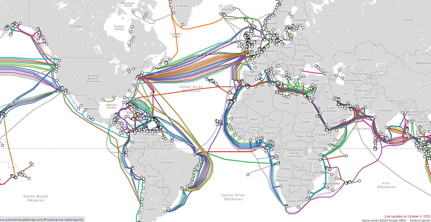

https://www.submarinecablemap.com/

---

### **Shortcuts**

$$
\text{Before starting to do anything, if there are shortcuts, try to learn them.}
$$

---

#### Microsoft Helper Toolkits

- Install Power Toys Utility
  - https://learn.microsoft.com/en-us/windows/powertoys/
- Download Sysinternals Suite (Toolkit)
  - https://learn.microsoft.com/en-us/sysinternals/downloads/sysinternals-suite

---

#### Windows Shortcuts

- **Copy**: `Ctrl+C`
- **Cut**: `Ctrl+X`
- **Paste**: `Ctrl+V`

---

#### Windows Shortcuts

- **Snipping Tool**: `Win+Shift+S`
- Depending on your hardware **take a screenshot**
  - `Win+PrtScn`
  - `Fn+Win+Space`. 

---

#### Windows Shortcuts (Power Toys)

- **Power Toys Run**: `Alt+Space`
- **Always-on-Top**: `Win+Ctrl+T` 
- **Color Picker** : `Win+Shift+C`
- **Screen Ruler** : `Win+Shift+T`
- **Video Conf. Mute** : `Win+Shift+Q`

---

#### Windows Shortcuts

- **Maximize Window**: `F11` or `Win+UpArrow` 
- **Open Task View**: `Win+Tab`
- **Display and hide the desktop**: `Win+D`
- **Switch between open apps**: `Alt+Tab`
- **Open the Quick Link menu**: `Win+X`
- **Lock your PC**: `Win+L`

---

### Introduction to the command line interface

- Reference Books
  - [Bash Notes For Professionals](files/BashNotesForProfessionals.pdf) 
  - [Linux Notes For Professionals](files/LinuxNotesForProfessionals.pdf)
  - [PowerShell Notes For Professionals](files/PowerShellNotesForProfessionals.pdf)

---

#### What is the command line?

The window, which is usually called the **command line** or **command-line interface**, is a text-based application for viewing, handling, and manipulating files on your computer. It's much like Windows Explorer or Finder on the Mac, but without the graphical interface. Other names for the command line are: 

`cmd, CLI, prompt, console or terminal `

While there are many commands you can use with CLI, they all fall into <u>two categories</u>:

- The commands that handle the processes

- The commands that handle the files

[reference]([Introduction to command line · HonKit](https://tutorial.djangogirls.org/en/intro_to_command_line/))

---

#### Why Would You Use CLI over GUI?

- **Less Resource**
  It is not a secret that the text-based program needs very little resources of your computer. This means that with CLI you can do similar tasks with minimum resources.

---

#### Why Would You Use CLI over GUI?

- **High Precision**
  You can use a specific command to target specific destinations with ease. As long as you don’t type the wrong command, it will work like a charm. Once you learn the basics, writing syntax is not as hard as you might think.

---

#### Why Would You Use CLI over GUI?

- **Repetitive Tasks Friendly**
  GUI has developed well over the years. But, the operating system may not give you all the menus and buttons to perform all tasks. One of the reasons is safety. This leaves you overwhelmed if you have to do repetitive tasks. For example, when you have to handle hundreds of files within a folder, CLI enables you to use a single command to do automate the repetition easily.

---

#### Why Would You Use CLI over GUI?

- **Powerful**
  Most operating systems today prevent you from messing up the system’s core process. Windows has system protection and MacOS has SIP (System Integrity Protection). You won’t be able to perform certain tasks which are system protected. However, with CLI, you will have full control over your system.

---

#### Open the command-line interface (Windows)

- Go to the Start menu or screen, and enter `Command Prompt` in the search field.

- Go to `Start menu → Windows System → Command Prompt`.

- Go to `Start Menu → All Programs → Accessories → Command Prompt`.

- Go to the Start screen, hover your mouse in the lower-left corner of the screen, and click the down arrow that appears (on a touch screen, instead flick up from the bottom of the screen). The Apps page should open. Click on Command Prompt in the Windows System section.

- Hold the special Windows key on your keyboard and press the "X" key. Choose "Command Prompt" from the pop-up menu.

- Hold the Windows key and press the "R" key to get a "Run" window. Type "cmd" in the box, and click the OK key.

---

#### Open the command-line interface (Windows)

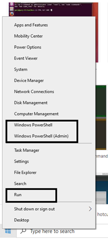

---

#### Open the command-line interface (Windows)


---

#### Open the command-line interface (Windows)

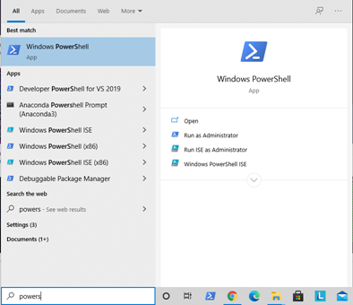

---

#### Open the command-line interface (Windows)


---

#### Open the command-line interface (Windows)


---

#### Open the command-line interface (Linux)

 It's probably under 

- Applications → Accessories → Terminal,  
  or 
- Applications → System → Terminal, 
  but that may depend on your system. 
  If it's not there, you can try to Google it. :)

---

#### Open the command-line interface (Linux)


---

#### Open the command-line interface (MacOS)

- Go to Applications → Utilities → Terminal


---

### **Command Basics**

---

#### Command Basics (Computer Name,Current Directory Path)

```
> whoami (hit enter)
```
- Result: laptop-rqnns9ig\ugur.coruh
  - Computer will print username

---

#### Command Basics (Computer Name,Current Directory Path)

```
> pwd 
```
- Result: /Users/ugur.coruh
  - Current Working Directory for Linux and OS X

---

#### Command Basics (Computer Name,Current Directory Path)

```
>cd
```
- Result: C:\Users\ugur.coruh
  - Current Working Directory for Windows

---

#### Learn Command Details in Linux and OS X

```
>man <command_name>
```
Sample 

```
>man pwd
```
- OS X and Linux have a man command,which gives you help on commands
  
- Use the `space` bar to move to the next page, and `q` to quit looking at the help

---

#### Learn Command Details in Window

- Adding a `/?` suffix to most commands will print the help page
- Sample

```
>cd /? 
```

---

#### List files and directories in Linux and OS X

```
>ls
```

- Applications
- Desktop
- Downloads
- Music
- ...

---

#### List files and directories in Linux and OS X

```
>ls -R
```
- will list all the files in the sub-directories as well

---

#### List files and directories in Linux and OS X

```
>ls -a
```
- will show the hidden files

---

#### List files and directories in Linux and OS X

```
>ls -al
``` 
- will list the files and directories with detailed information like the permissions, size,owner, etc.

---

#### List files and directories in Windows

```
>dir
```
Result: 

```
Volume in drive C is Windows
Volume Serial Number is 8C3C-8F8C
Directory of C:\Users\ugur.coruh
10/14/2020  09:57 AM    <DIR>          .
10/14/2020  09:57 AM    <DIR>          ..
08/15/2020  11:00 PM    <DIR>          .android
06/28/2020  03:02 AM    <DIR>          AndroidStudio4.0

```

---

#### List files and directories in Linux, OS X

- you should install with `brew install tree`

---

#### List files and directories in Windows

```
> tree
```
Result:
```
C:\Users\ugur.coruh\Desktop\Samples>tree
Folder PATH listing for volume Windows
Volume serial number is 8C3C-8F8C
       C:.
       ├───C
       │   └───HelloWorld
       │       └───.vscode
       ├───Cpp
       ├───Csharp
       └───Java
```

---

#### Change Current Directory in Windows / Linux and OS X

```
>cd <path>
```

```
cd Desktop 
```

---

#### Change Current Directory in Windows / Linux and OS X

- print case-sensitive prefix of targer folder and use `tab` to complete or find
correct folder

```
> cd ..
```

- This command moves current working directory to parent directory.
- You can use `cd ..\..\..` to go 3 level up.

---

#### Change Current Directory in Windows / Linux and OS X

- Also you can change relative path such as 
  - `cd ..\..\target\child`
    - go 2 level up and then go to target and child folders.
- To directly go to folder write full path of file `cd C:\temp\build\target\child`

---

#### Change Current Directory in Windows / Linux and OS X

`>cd-` (with a hyphen) to move to your previous directory

- We will use this feature with CMAKE!


---

#### Create Directory in Windows, Linux, OS X

```
> mkdir folder_name
```
- To generate a new directory inside another directory, use this Linux basic command `mkdir Music/Newfile`

---

#### Create Directory in Windows, Linux, OS X

- use the `p` (parents) option to create a directory in between two existing directories.

- For example, `mkdir -p Music/2020/Newfile` will
create the new “2020” file.

---

#### Create Directory in Windows, Linux, OS X

- Check folder creation is succeed with list commands 
- Linux,OS X -> `ls`
- Windows -> `dir` or `tree`

```
> dir
```
- Use cd folder_name from current directory for going to created folder

```
> cd folder_name
```

---

#### Remove Directory in Windows Powershell, OS X and Linux

```
> rm –r  folder_path
```

```
>rmdir
```

- `-r` is used for recursive deletion
of folders.

- However, `rmdir` only allows you to delete empty directories

---

#### Remove Directory in Windows Powershell

```
> rmdir /S folder_path
```
```
folder_path, Are you sure
<Y/N>? Y
```
- Check deletion with folder listing commands.

---

#### Command Basics (Delete File) in Windows

```
>DEL /F untitled.txt*
```
- If you want to add the options like force deletion, you can add it before the file name


---

#### Copy Files in Linux

- Use the `cp` command to copy files from the current directory to a different directory.

- For instance, the command `cp scenery.jpg /home/username/Pictures` would create a copy of `scenery.jpg` (from your current directory) into the `Pictures` directory.

---

#### Copy Files in Windows

- `cd-` (with a hyphen) to move to your previous directoryCopy a file in the current folder

```
>COPY source_file.doc newfile.doc
```
- Copy from a different `folder/directory:`

```
>COPY "C:\my work\some file.doc" "D:\New docs\newfile.doc"
```
---

#### Copy Files in Windows

- Specify the source only, with a wildcard will copy all the files into the current directory:*

```
>COPY "C:\my work\*.doc"
```
- Specify the source with a wildcard and the destination as a single file, this is generally only useful with plain text files.

```
>COPY "C:\my work\*.txt" "D:\New docs\combined.txt"
```

---

#### Copy Files in Windows

- Quiet copy (no feedback on screen)*

```
COPY source_file.doc newfile.doc >nul
```
- Copy a file, but do not overwrite if the destination file already exists, this technique only works for a single file, no wildcards:

```
Echo n|COPY /-y c:\demo\source_file.txt c:\dir\dest.txt
```
---

#### Renaming File in Windows

```
>REN d:untitled.txt untitled1.txt*
```
- To rename a file within a specific folder, use 

```
REN [drive:][path] [source] [target]
```
- If you mention the location, that means the renamed file will be saved in the same folder

```
>REN d:untitled.txt ..\..\folder\untitled1.txt*
```
```
>REN d:untitled.txt C:\folder\untitled1.txt
```

---

#### Renaming File in  Linux and OS X

```
>mv [OPTIONS] source destination*
```
```
>mv file1.txt file2.txt*
```

- Optional `sudo apt install rename`

---

#### Move Files in Windows

- In the current folder

```
>MOVE oldfile.wp newfile.doc
```
- Full path specified

```
>MOVE g:\department\oldfile.wp "c:\Files to
Convert\newfile.doc"
```
- Specify the drive and filename (assumes the current folder on both drives is correct)

```
>MOVE a:oldfile.wp c:newfile.doc
```
---

#### Move Files in Windows

- Specify source only (will copy the file to current folder, keeping the same filename)

```
>MOVE g:\department\oldfile.wp
```
- Quiet move (no feedback on screen)

```
>MOVE oldfile.wp newfile.doc >nul
```
- Move a file, but do not overwrite if the destination file already exists, this technique only works for a single file, no wildcards
- ( /-y is required):

```
>Echo n|MOVE /-y c:\file1.txt c:\dir\file1.txt
```

---

#### Move Files in Linux and OS X

- Check `mv` command

- For example: `mv file.txt /home/username/Documents`

---

#### Command Basics (Renaming a Volume Disk) in Windows

```
D:\ > LABEL d:MyData
```

---

#### Measure Processing Time in Windows Powershell 

```
> Measure-Command {echo hi}
```
```
Days  : 0
Hours : 0
Minutes    : 0
Seconds    : 0
Milliseconds     : 0
Ticks  : 1318
TotalDays : 1.52546296296296E-09
TotalHours       : 3.66111111111111E-08
TotalMinutes   : 2.19666666666667E-06
TotalSeconds    : 0.0001318
TotalMilliseconds : 0.1318

```

---

#### Measure Processing Time in Windows Command Prompt

```
> powershell -Command "Measure-Command {echo hi}"
```
---

#### Command Basics (Measure Processing Time)

**timecmd.bat**

```
@echo off
@setlocal
set start=%time%
:: Runs your command
cmd /c %*
set end=%time%
set options="tokens=1-4 delims=:.,"
for /f %options% %%a in ("%start%") do set start_h=%%a&set /a start_m=100%%b %% 100&set /a start_s=100%%c %% 100&set /a start_ms=100%%d %% 100
for /f %options% %%a in ("%end%") do set end_h=%%a&set /a end_m=100%%b %% 100&set /a end_s=100%%c %% 100&set /a end_ms=100%%d %% 100
set /a hours=%end_h%-%start_h%
set /a mins=%end_m%-%start_m%
set /a secs=%end_s%-%start_s%
set /a ms=%end_ms%-%start_ms%
if %ms% lss 0 set /a secs = %secs% - 1 & set /a ms = 100%ms%
if %secs% lss 0 set /a mins = %mins% - 1 & set /a secs = 60%secs%
if %mins% lss 0 set /a hours = %hours% - 1 & set /a mins = 60%mins%
if %hours% lss 0 set /a hours = 24%hours%
if 1%ms% lss 100 set ms=0%ms%
:: Mission accomplished
set /a totalsecs = %hours%*3600 + %mins%*60 + %secs%
echo command took %hours%:%mins%:%secs%.%ms% (%totalsecs%.%ms%s total)

```
---

#### Command Basics (Measure Processing Time)

**Usage**

- If you put `timecmd.bat` in a directory in your path, you can call it from anywhere like this:

```
>timecmd [your command]
```
- E.g.

```
C:\>timecmd
pause
Press any key to continue .
. . command took 0:0:1.18
```

---

#### Command Basics (Measure Processing Time)

- If you want to do output redirection, you can quote the command like this:

```
timecmd "dir c:\windows /s > nul"
```

- This should handle commands that run from before- to after-midnight, but the output will be wrong if your command runs for 24 hours or more.

---

### Useful Linux Commands

- Use Online Sandbox to
- Try Commands Yourself
  - https://ubunlog.com/en/gnulinux-online-terminals-browser/
    - https://bellard.org/jslinux/vm.html?url=alpine-x86.cfg&mem=192

---

#### cat command

- `cat` (short for concatenate) is one of the most frequently used commands in Linux. It is used
to list the contents of a file on the standard output (sdout). To run this command, type `cat` followed by the file’s name and its extension. For instance: `cat file.txt`.

- Here are other ways to use the `cat` command:

- `cat > filename` creates a new file

- `cat filename1 filename2>filename3` joins two files (1 and 2) and stores the output of them in a new file (3)

- to convert a file to upper or lower case use, **cat
filename | tr a-z A-Z >output.txt**

---

#### touch command

- The `touch` command allows you to create a blank new file through the Linux command line. As an example, enter touch `/home/username Documents/Web.html` to create an HTML file entitled `Web` under the `Documents` directory.  

---

#### locate command

- You can use this command to `locate` a file, just like the search command in Windows. What’s more, using the `-i` argument along with this command will make it case-insensitive, so you can search for a file even if you don’t remember its exact name.

- To search for a file that contains two or more words, use an asterisk (`*`). For example, `locate -i school*note*` command will search for any file that contains the word “`school`” and “`note`”, whether it is uppercase or lowercase.

---

#### find command

- Similar to the `locate` command, using `find` also searches for files and directories. The difference is, you use the `find` command to locate files within a given directory.

- As an example, find `/home/ -name notes.txt` command will search for a file called `notes.txt` within the home directory and its subdirectories.

- Other variations when using the `find` are:

- To find files in the current directory use, `find -name notes.txt`

- To look for directories use, `/ -type d -name notes. txt`

---

#### grep command

- Another basic Linux command that is undoubtedly helpful for everyday use is `grep`. It lets you search through all the text in a given file.

- To illustrate, `grep blue notepad.txt` will
search for the word blue in the notepad file. Lines that contain the searched word will be displayed fully.

---

#### sudo command

- Short for "**SuperUser Do**", this command enables you  to perform tasks that require administrative or root permissions. However, it is not advisable to use this command for daily use because it might be easy for an error to occur if you did something wrong.  

---

#### df command

- Use `df` command to get a report on the system’s disk space usage, shown in percentage and KBs. If you want to see the report in megabytes, type `df -m`.  

---

#### du command

- If you want to check how much space a file or a directory takes, the `du` (Disk Usage) command is the answer. However, the disk usage summary will show disk block numbers instead of the
usual size format. If you want to see it in bytes, kilobytes, and megabytes, add the `-h` argument to the command line.

---

#### head command

• The `head` command is used to view the first
lines of any text file. By default, it will show the first ten lines, but you can change this number to your liking. For example, if you only want to show the first five lines, type `head -n 5 filename.ext`.  

---

#### tail command

- This one has a similar function to the head command, but instead of showing the first lines, the `tail` command will display the last ten lines of a text file. For example, `tail -n filename.ext.`  

---

#### diff command

- Short for difference, the `diff` command compares the contents of two files line by line. After analyzing the files, it will output the lines that do not match. Programmers often use this command when they need to make program alterations instead of rewriting the entire source code.

- The simplest form of this command is `diff file1.ext file2.ext`

---

#### tar command

- The `tar` command is the most used command to archive multiple files into a `tarball` — a common Linux file format that is similar to zip format, with compression being optional.

- [https://www.linuxtechi.com/17-tar-command-examples-in-linux/](https://www.linuxtechi.com/17-tar-command-examples-in-linux/)

---

#### chmod command

- `chmod` is another Linux command, used to change the read, write, and execute permissions of files
and directories.

- https://www.computerhope.com/unix/uchmod.htm  

---

#### chown command

- In Linux, all files are owned by a specific user. The `chown` command enables you to change or transfer the ownership of a file to the specified username. For instance, `chown linuxuser2 file.ext` will make `linuxuser2` as the owner of the `file.ext`.  

---

#### jobs command

- `jobs` command will display all current jobs along with their statuses. A job is basically a process that is started by the shell.
- The jobs command displays the status of jobs started in the current terminal window. Jobs are numbered starting from 1 for each session. The job ID numbers are used by some programs instead of PIDs (for example, by fg and bg commands).

---

#### kill command

- If you have an unresponsive program, you can terminate it manually by using the `kill` command. It will send a certain
signal to the misbehaving app and instructs the app to terminate itself.

- There is a total of [sixty-four-signals](https://linoxide.com/linux-how-to/linux-signals-part-1/) that you can use, but people usually only use two signals:

---

#### kill command

- `SIGTERM (15)`: requests a program to stop running and gives it some time to save all of its progress. If you don’t specify the signal when entering the kill command, this signal will be used.

---

#### kill command

- `SIGKILL (9)`: forces programs to stop immediately. Unsaved progress will be lost.

- Besides knowing the signals, you also need to know the process identification number (PID) of the program you want to `kill`. If you don’t know the PID, simply run the command `ps ux`.

- After knowing what signal you want to use and the PID of the program, enter the following syntax: `kill [signal option] PID`.

- [https://linoxide.com/linux-how-to/linux-signals-part-1/](https://linoxide.com/linux-how-to/linux-signals-part-1/)

---

#### ping command

- Use the `ping` command to check your connectivity
status to a server. For example, by simply entering `ping google.com`, the command will check whether you’re able to
connect to Google and also measure the response time.  

---

#### wget command

- The Linux command line is super useful — you can even download files from the internet with the help of the `wget` command. To do so, simply type `wget` followed by the download link.  

---

#### uname command

- The `uname` command, short for Unix Name, will print detailed information about your Linux system like the machine name, operating system, kernel, and so on.

---

#### top command

- As a terminal equivalent to Task Manager in Windows, the `top` command will display a list of running processes and how much CPU each process uses. It’s very useful to monitor system resource usage, especially knowing which process needs to be terminated because it consumes too many resources.

---

#### history command

- When you’ve been using Linux for a certain period of time, you’ll quickly notice that you can run hundreds of commands every day. As such, running `history` command is particularly useful if you want to review the commands you’ve entered before.  

---

#### echo command

- This command is used to move some data into a file. For example, if you want to add the text, “`Hello, my name is John`” into a file called `name.txt`, you would type `echo Hello, my name is John >> name.txt`  

---

#### zip, unzip command

- Use the `zip` command to compress your files into a zip archive, and use the `unzip` command to extract the zipped files from a zip archive.  

---

#### hostname command

- If you want to know the name of your host/network simply type `hostname`. Adding a `-I` to the end will display the IP address of your network.

- Hostnamectl
  - [https://www.cyberciti.biz/faq/find-my-linux-machine-name/](https://www.cyberciti.biz/faq/find-my-linux-machine-name/)

---

#### host command

- [host command](https://www.cyberciti.biz/faq/linux-unix-host-command-examples-usage-syntax/) is a simple utility for performing DNS lookups. It is normally used to convert names to IP addresses and vice versa. When no arguments or options are given, host command displays a short summary of its command line arguments and options. The syntax is as follows:

- `host example.com`
- `host -t TYPE example.com`
- `host -t a example.com`

- [https://www.cyberciti.biz/faq/unix-linux-dns-lookup-command/](https://www.cyberciti.biz/faq/unix-linux-dns-lookup-command/)

---

#### host command

- Installation of host command if not found

`root@user:~# apt-get update`
`root@user:~# apt-get install dnsutils –y`

- [https://www.crybit.com/install-dig-nslookup-host-commands/](https://www.crybit.com/install-dig-nslookup-host-commands/)

---

#### useradd, userdel command

- Since Linux is a multi-user system, this means more than one person can interact with the same system at the same time. `useradd` is used to create a new user, while `passwd` is adding a password to that user’s account. To add a new person named John type, `useradd John` and then to add
his password type, `passwd 123456789`. 

- To remove a user is very similar to adding a new user. To delete the users account type, `userdel UserName`

---

### Tips and Tricks for Linux CLI

- Try the `TAB` button to autofill what you are typing

- For example, if you need to type Documents, begin to type a command (let’s go with `cd Docu` then hit the TAB key) and the terminal will fill in the rest, showing you `cd Documents`

- `Ctrl+C` and `Ctrl+Z` are used to stop any command that is currently working. `Ctrl+C` will stop and terminate the command, while `Ctrl+Z` will simply pause the command.

---

#### Tips and Tricks for Linux CLI

- If you accidental freeze your terminal by using `Ctrl+S`, simply undo this with the unfreeze `Ctrl+Q`.

- `Ctrl+A` moves you to the beginning of the line while `Ctrl+E` moves you to the end

- You can run multiple commands in one single command by using the `;` to separate them. For example `Command1; Command2; Command3` Or use `&&` if you only want the next command to run when the first one is successful.

---

### Useful Windows Commands

---

#### ASSOC: Fix File Associations

- One of the most powerful tools in the CMD command library is the ASSOC command.

- Your computer associates certain file extensions with certain programs. This is how your computer knows to open Adobe when you double click a PDF file, or Microsoft Word when you double click a DOC file.

- You can view all the file associations your computer knows about by typing `ASSOC` in the command window. You’ll see
the file extension and the program it’s associated with.

- You can set the association by typing something like `assoc .doc=Word.Document.8`.

---

#### FC: File Compare

- Sometimes when files are changed over time, it’s hard to remember what the differences were between versions. You may not know that a CMD command offers the ability to compare files and see all differences, but it’s true. 
- The `FC` command performs either an ascii or a binary file comparison and will list all of the differences that it finds.

- `Fc /a File1.txt File2.txt` will compare two ascii files.
- `Fc /b Picture1.jpg Picture2.jpg` will do a binary compare on two images.

---

#### IPCONFIG

- Network troubleshooting is never simple, but one command that makes it much easier is `IPCONFIG`.
- Using this command in the CMD command prompt returns detailed information about your current network adapter
connection including:
- Current IP Address
- Subnet Mask
- Default Gateway IP
- Current domain

This information can help you troubleshoot router issues and other connection issues you could be having with your network adapter.

---

#### IPCONFIG

Examples:
```
> ipconfig                       ... Show information
> ipconfig /all                  ... Show detailed information
> ipconfig /renew            ... renew all adapters
> ipconfig /renew EL*      ... renew any connection that has its name starting with EL
> ipconfig /release *Con*        ... release all matching connections, eg.
```
---

#### IPCONFIG

"Wired Ethernet Connection 1" or "Wired Ethernet Connection 2"
`> ipconfig /all` compartments  ... Show information about all compartments
`> ipconfig /all` compartments /all ... Show detailed information about all compartments
`/?` Display this help message
`/all `Display full configuration information.
`/release` Release the IPv4 address for the specified adapter.
`/release6` Release the IPv6 address for the specified adapter.

---

#### IPCONFIG

`/renew`           Renew the IPv4 address for the specified adapter.
`/renew6`          Renew the IPv6 address for the specified adapter.
`/flushdns`  Purges the DNS Resolver cache.
`/registerdns `      Refreshes all DHCP leases and re-registers DNS names
`/displaydns`        Display the contents of the DNS Resolver Cache.
`/showclassid`    Displays all the dhcp class IDs allowed for adapter.
`/setclassid` Modifies the dhcp class id.
`/showclassid6`    Displays all the IPv6 DHCP class IDs allowed for adapter.
`/setclassid6`     Modifies the IPv6 DHCP class id.

---

#### NETSTAT: Network Statistics

- Concerned that you could have malware running on your computer that’s connecting to internet locations without you knowing about it?
- If you run a `NETSTAT` command in the
command prompt, you can get a list of all active TCP connections from your computer.

---

#### PING: Send Test Packets

- An IT Analyst’s best friend is the `PING` command.
Running this command sends test packets over the network to the target system.

- You can use the `PING` command to test whether your computer can access another computer, a server, or even a website. It can help with revealing network disconnections. It also provides transit time for the packets in milliseconds,
so it also reveals a bad network connection as well.   

---

#### PING: Send Test Packets

- https://ipstack.com/
  - ipstack offers one of the leading

---

#### TRACERT: Trace Route IP to geolocation

- APIs and global IP database services worldwide.

---

#### POWERCFG: Power Configuration

- Are you frustrated with how quickly your laptop seems to run out of power? It could be that your power settings are configured as efficiently as possible. There’s a
windows CMD command called `POWERCFG` (power configuration) that can help. 

---

#### POWERCFG: Power Configuration

Run the command prompt as an administrator and
type

- `powercfg – energy` to get a full power efficiency report.

- The process can take up to about a minute, but when it’s done, you’ll see whether there are any warnings or errors that might help you improve the power efficiency of your system.

---

#### SHUTDOWN: Turn Off Computer

- The `SHUTDOWN` command is a pretty versatile command that lets you shutdown the computer but control the behavior
of that shutdown. It’s commonly used as a scheduled task or part of an IT batch job after patches have been applied to a computer system.

- Typing `shutdown /i` from the command prompt will initiate a shutdown, but it’ll upon a GUI to give the user an option on
whether to restart or do a full shutdown. If you don’t want to have any GUI pop up, you can just issue a `shutdown /s` command.

- There is a long list of other parameters you can use to do a log off, hibernate, restart, and more. Just type `shutdown` without any arguments to see them all.

---

#### SYSTEMINFO: System Information

- If you need to know what brand of network card you have, processor details, or the exact version of your Windows OS, the `SYSTEMINFO` command can help.

- This command polls your system and pulls the most important information about your system. It lists the information in a clean format that’s easy to read.

---

#### SFC: System File Checker

- If you’re ever concerned that a virus or some other software might have corrupted your core system files, there’s a Windows command that can scan those files and
ensure their integrity.

- You need to launch CMD as administrator (right click and choose **Run as Administrator**). Typing `SFC /SCANNOW` will check the integrity of all protected system files. If a problem
is found, the files will be repaired with backed-up system files.

---

#### SFC: System File Checker

- The
SFC command also lets you:
- `/VERIFYONLY`: Check the integrity but don’t repair the files.
- `/SCANFILE`: Scan the integrity of specific files and fix if corrupted.
- `/VERIFYFILE`: Verify the integrity of specific files but don’t repair them.
- `/OFFBOOTDIR`: Use this to do repairs on an offline boot directory.
- `/OFFWINDIR`:
Use this to do repairs on an offline Windows directory.
- `/OFFLOGFILE`: Specify a path to save a log file with scan results.
- The scan can take up to 10 or 15 minutes, so give it time.    
---

#### NET USE: Map drives

- If you want to map a new drive, you could always open File Explorer, right click on This PC, and go through the Map Network Drive wizard. However, using the `NET USE` command, you can do the same thing with one command string.

- For example, if you have a share folder on a computer on your network called `\\OTHER-COMPUTER\SHARE\`, you can
map this as your own `Z:` drive by typing the command:

- `NET USE Z: “\\OTHER-COMPUTER\SHARE” /persistent:yes`

- The `persistent` switch tells your computer that you want this drive remapped every time you log back into your computer.

---

#### CHKDSK: Check Disk

- While the SFC command only checks the integrity of core system files, you can use the **CHKDSK** command to scan an entire drive.
- The command to check the C: drive and repair any problems, launch the command window as an administrator and type `CHKDSK /f C:`.
- This command checks for things like:
  - File fragmentation
  - Disk errors
  - Bad sectors
- The command can fix any disk errors (if possible). When the command is finished, you’ll see a status of the scan and what actions were taken.

---

#### SCHTASKS: Schedule Tasks

- Windows comes with a wizard for creating scheduled tasks. For example, maybe you have a BAT file stored on C:\temp that you want to run every day at noon.

- You’d have to click through the Scheduled Task wizard to configure this. Or you can type a single **SCHTASKS** command to set it up.

- `SCHTASKS /Create /SC HOURLY /MO 12 /TR Example /TN c:\temp\File1.bat`

- The scheduled switch accepts arguments like minute, hourly, daily, and monthly. Then you specify the frequency with the /MO command.
- If you typed the command correctly, you’ll see the response, **SUCCESS: The scheduled task “Example” has successfully been created**.

---

#### ATTRIB: Change File Attributes

- In Windows, you can change file attributes by right clicking on a file and finding the right property to change. However, instead of hunting around for the file attribute, you can use the **ATTRIB** command to set the file attributes.
- For example, if you type: `ATTRIB +R +H C:\temp\File1.bat`, it’ll set File1.bat as a hidden, read-only file.
- There is no response when it’s successful, so unless you see an error message, the command worked.

---

#### Other Windows CMD Commands

- `BITSADMIN`: Initiate upload or download jobs over the network or internet and monitor the
current state of those file transfers.
- `COLOR`: Change the background color of the command prompt window.
- `COMP`: Compare the contents of any two files to see the differences.
- `FIND/FINDSTR`: Search for strings inside of any ASCII files.
- `PROMPT`: Change the command prompt from C:\> to something else.
- `TITLE`: Change the title of the command prompt window.
- `REGEDIT`: Edit keys in the Windows registry (use with caution).
- `ROBOCOPY`: A powerful file copy utility built right into Windows.

---

###  References

- [GitHub - kamranahmedse/developer-roadmap: Roadmap to becoming a web developer in 2021](https://github.com/kamranahmedse/developer-roadmap)

- [GitHub - jwasham/coding-interview-university: A complete computer science study plan to become a software engineer.](https://github.com/jwasham/coding-interview-university)

- [GitHub - sindresorhus/awesome: 😎 Awesome lists about all kinds of interesting topics](https://github.com/sindresorhus/awesome)

---

###  References

- [https://www.hostinger.com/tutorials/what-is-cli](http://derekmolloy.ie/hello-world-introductions-to-cmake/)

- [https://www.hostinger.com/tutorials/linux-commands](http://derekmolloy.ie/hello-world-introductions-to-cmake/)

- [https://tutorial.djangogirls.org/en/intro_to_command_line/](http://derekmolloy.ie/hello-world-introductions-to-cmake/)

- [https://stackoverflow.com/questions/673523/how-do-i-measure-execution-time-of-a-command-on-the-windows-command-line](http://derekmolloy.ie/hello-world-introductions-to-cmake/)

---

###  References

- [https://helpdeskgeek.com/help-desk/21-cmd-commands-all-windows-users-should-know/](http://derekmolloy.ie/hello-world-introductions-to-cmake/)

- [Introduction to CMake by Example | derekmolloy.ie](http://derekmolloy.ie/hello-world-introductions-to-cmake/)

- [CMake - Cross Platform Make](https://cmake.org/cmake/help/v2.8.8/cmake.html)

- [Windows commands | Microsoft Learn](https://docs.microsoft.com/en-us/windows-server/administration/windows-commands/windows-commands)


### Week-2

#### Software Development Environments

Download [DOC](ce103-week-2-setup.en.md_doc.pdf), [SLIDE](ce103-week-2-setup.en.md_slide.pdf), [PPTX](ce103-week-2-setup.en.md_slide.pptx)

<iframe width=700, height=500 frameBorder=0 src="../ce103-week-2-setup.en.md_slide.html"></iframe>

---

<!-- paginate: true -->

#### Outline

- Flowgorithm
- Introduction to Analysis of Algorithms
- Programming Environment Setup and Configuration
 	- C/C++ (DevCpp,Code Blocks,MinGW,LLVM,VsCode,VisualStudio,Notepad++,Vi/Vim,Eclipse,Netbeans,Cmake/Make)
	- Java (VsCode,Notepad++,Eclipse,Netbeans,Cmake)
	- C# (VsCode,Notepad++,VsCode,VisualStudio,Cmake)

---

#### Outline

- Common Tools and Platforms
	- Fatih Kalem, Notepad++,HxD, MarktextApp,Cygwin,Dependency Walker,Doxygen,Sonarlint,
Codepen.io, Codebeautify.org, Codeshare.io,AsciiFlow.com, Freemind, Mockflow, Wireflow, PlantUML,Drawio,Putty, MobaXterm,Teamviewer,AnyDesk,Paletton.com,Colorhunt.co,Understand,JD Project,Cutter,IDA Pro / Freeware,pythontutor,godbolt,scrcpy,Travis-CI,AppVeyor,Jenkins,Vagrant,Docker / Docker Compose / Kubernetes,Nuget,SCV Cryptomanager,Addario CryptoBench,Raymond's MD5 & SHA Checksum Utility,SlavaSoft HashCalc,Portable PGP, and more ...

---

## Algorithm Basics

---

### Flowgorithm (1)

- http://www.flowgorithm.org/

- [Flowgorithm - Documentation](http://www.flowgorithm.org/documentation/index.html)

- https://github.com/timoteoponce/flowgorithm-examples

---

<style scoped>section{ font-size: 25px; }</style>

#### Flowgorithm (2)

- Main Window

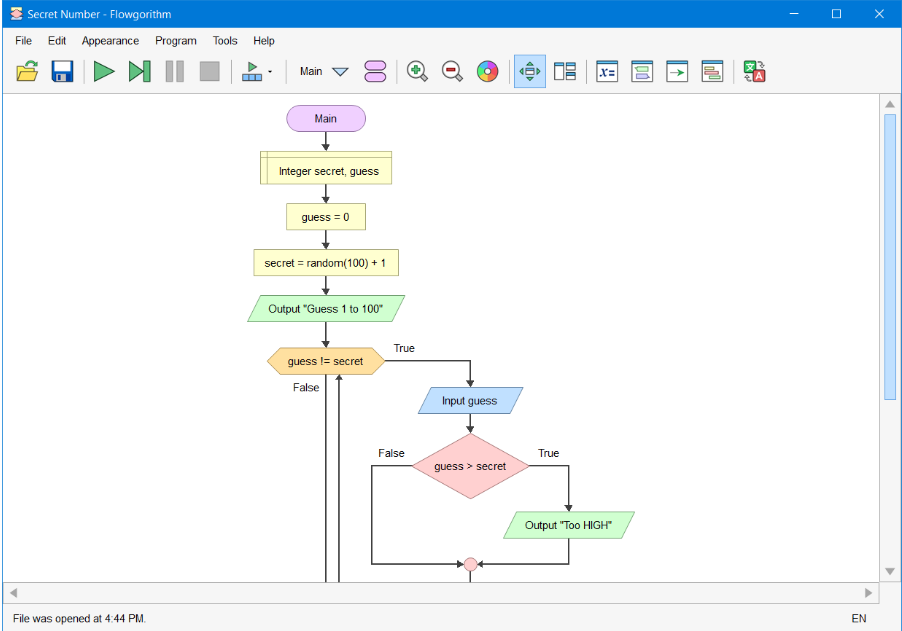

---

<style scoped>section{ font-size: 25px; }</style>

#### Flowgorithm (3)

- Console Window
  - The classic method to interact with the computer is to use the "Console". Flowgorithm attempts to make it look like a typical instant messenger window. The "chat bubbles" are color coded to match the Input and Output shapes used in the flowchart. If you don't want to use the chat bubbles, you can also toggle between them and the classical plain text.

---

<style scoped>section{ font-size: 25px; }</style>

#### Flowgorithm (4)

- Console Window

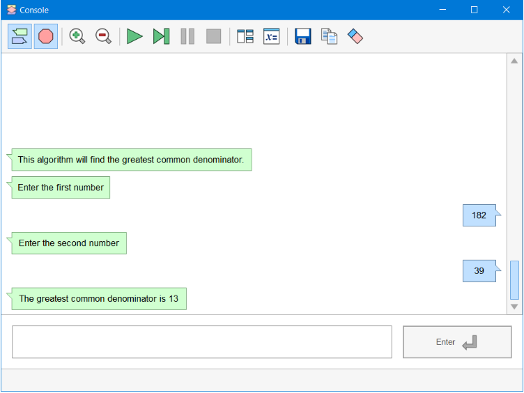

---

<style scoped>section{ font-size: 25px; }</style>

#### Flowgorithm (5)

- Source Code Viewer Window
  - The Source Code Viewer can convert your flowchart to several major programming languages. So, if you planning to learn a high-level language, then this feature should help you along the way.

---

<style scoped>section{ font-size: 25px; }</style>

#### Flowgorithm (6)

- Source Code Viewer Window

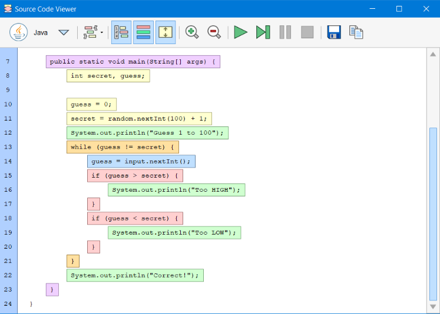

---

<style scoped>section{ font-size: 25px; }</style>

#### Flowgorithm (7)

- Variable Watch Window
  - The variable watch window is used to keep track of how your variables are changing as your program executes. Each variable is color-coded based on its data type. At a glance, you can tell exactly what type of data is being stored - and catch where you may want to use a different data type.

---

<style scoped>section{ font-size: 25px; }</style>

#### Flowgorithm (8)

- Variable Watch Window


---

<style scoped>section{ font-size: 25px; }</style>

#### Flowgorithm (8)

- More Resources for Flowgorithm
  - [Flowgorithm Tutorial - TestingDocs.com](https://www.testingdocs.com/flowgorithm-flowchart-tutorial/)

---

<style scoped>section{ font-size: 25px; }</style>

### Pseudocode (1)

- Algorithm design language

  - [Pseudocode - Wikipedia](https://en.wikipedia.org/wiki/Pseudocode)

  - [Pseudocode Examples](https://www.unf.edu/~broggio/cop2221/2221pseu.htm)

  - [How to write a Pseudo Code? - GeeksforGeeks](https://www.geeksforgeeks.org/how-to-write-a-pseudo-code/)

---

<style scoped>section{ font-size: 25px; }</style>

### Introduction to Analysis of Algorithms

- In this course, we will learn how to code with several development environments and next term we will see an analysis of algorithms in detail.

- This topic is covered in the following link:

  - [CE100 Introduction to Analysis of Algorithms](https://ucoruh.github.io/ce100-algorithms-and-programming-II/week-1/ce100-week-1-intro/)

---

<style scoped>section{ font-size: 25px; }</style>

### Programming Environment Setup and Configuration

- Programming life is not about only learning how to code. Mostly you need to use several code development environments and you need to learn how to use them efficiently.

---

<style scoped>section{ font-size: 25px; }</style>

### C / C++ Environment and Development

---

<style scoped>section{ font-size: 25px; }</style>

#### DevCpp (Install / Compile / Run / Debug) (1)

- Download DevC++ IDE from the following link
  - https://www.bloodshed.net/

---

<style scoped>section{ font-size: 25px; }</style>

##### DevCpp (Install / Compile / Run / Debug) (2)

- Open DevC++ IDE for C Project Generation `Open File->New->Project`


---

<style scoped>section{ font-size: 25px; }</style>

##### DevCpp (Install / Compile / Run / Debug) (3)

Select **Console Application** from **Basic** tab and with **C Project** Option and write a project name such as "**Hello**" then press OK

Select a folder and save **Hello.dev** project file.

---

<style scoped>section{ font-size: 25px; }</style>

##### DevCpp (Install / Compile / Run / Debug) (4)

- You will see a sample main with an empty body

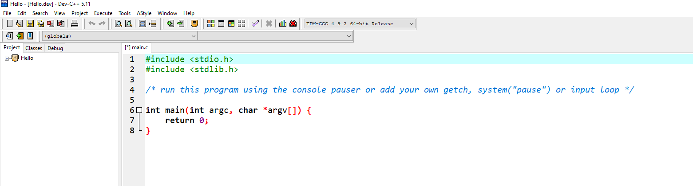

---

<style scoped>section{ font-size: 25px; }</style>

##### DevCpp (Install / Compile / Run / Debug) (5)

```c
#include <stdio.h>
#include <stdlib.h>

/* run this program using the console pauser or add your own getch, s,ystem("pause") or input loop */
int main(int argc, char *argv[]) {
    retAdd 0;
}
```

---

<style scoped>section{ font-size: 25px; }</style>

##### DevCpp (Install / Compile / Run / Debug) (6)

- Add the following line in the main function. This will write "Hello, World!" on the screen and then wait for a keypress to exit from the application

```c
#include <stdio.h>
#include <stdlib.h>

/* run this program using the console pauser or add your own getch, system("pause") or input loop */

int main(int argc, char *argv[]) {
    printf("Hello, World!");
    getchar();
    return 0;
}
```

---

<style scoped>section{ font-size: 25px; }</style>

##### DevCpp (Install / Compile / Run / Debug) (7)

- Then save the file

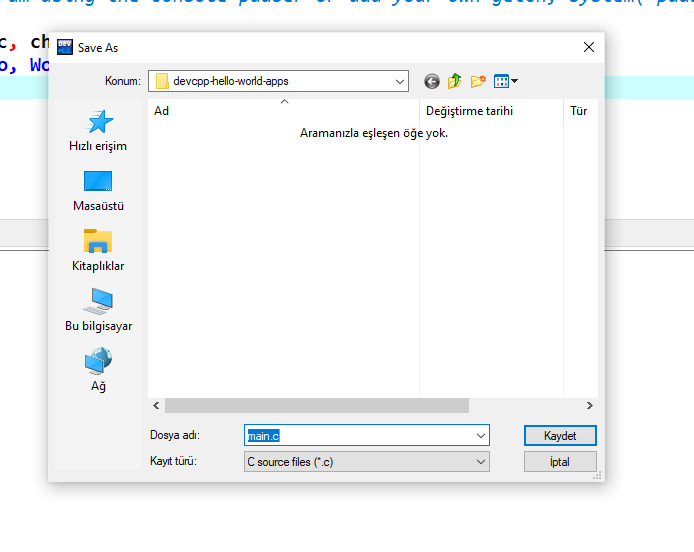

---

<style scoped>section{ font-size: 25px; }</style>

##### DevCpp (Install / Compile / Run / Debug) (8)

- Use from menu `Execute->Compile F5` to generate `Hello.exe`


---

<style scoped>section{ font-size: 25px; }</style>

##### DevCpp (Install / Compile / Run / Debug) (9)

- You can find the generated `Hello.exe` path from Compile.log as follow. Check the Output Filename

```batch
Compiling project changes...
--------
- Project Filename: E:\UgurCoruh\RTEU\Lectures\2021-2022 Güz CE103 - Algorithms and Programming I\Lectures\ce103-algorithms-and-programming-I\Week-2\devcpp-hello-world-apps\Hello.dev
- Compiler Name: TDM-GCC 4.9.2 64-bit Release

Building makefile...
--------
- Filename: E:\UgurCoruh\RTEU\Lectures\2021-2022 Güz CE103 - Algorithms and Programming I\Lectures\ce103-algorithms-and-programming-I\Week-2\devcpp-hello-world-apps\Makefile.win

Processing makefile...
--------
- Makefile Processor: C:\Program Files (x86)\Dev-Cpp\MinGW64\bin\mingw32-make.exe
- Command: mingw32-make.exe -f "E:\UgurCoruh\RTEU\Lectures\2021-2022 Güz CE103 - Algorithms and Programming I\Lectures\ce103-algorithms-and-programming-I\Week-2\devcpp-hello-world-apps\Makefile.win" all

gcc.exe -c main.c -o main.o -I"C:/Program Files (x86)/Dev-Cpp/MinGW64/include" -I"C:/Program Files (x86)/Dev-Cpp/MinGW64/x86_64-w64-mingw32/include" -I"C:/Program Files (x86)/Dev-Cpp/MinGW64/lib/gcc/x86_64-w64-mingw32/4.9.2/include"

gcc.exe main.o -o Hello.exe -L"C:/Program Files (x86)/Dev-Cpp/MinGW64/lib" -L"C:/Program Files (x86)/Dev-Cpp/MinGW64/x86_64-w64-mingw32/lib" -static-libgcc


Compilation results...
--------
- Errors: 0
- Warnings: 0
- Output Filename: E:\UgurCoruh\RTEU\Lectures\2021-2022 Güz CE103 - Algorithms and Programming I\Lectures\ce103-algorithms-and-programming-I\Week-2\devcpp-hello-world-apps\Hello.exe
- Output Size: 128,103515625 KiB
- Compilation Time: 2,13s
```

---

<style scoped>section{ font-size: 25px; }</style>

##### DevCpp (Install / Compile / Run / Debug) (10)

- Then you can run with `Execute->Run F10` or Directly `Compile&Run F11`


---

##### DevCpp (Install / Compile / Run / Debug) (11)

for debugging operations, just change the code and add more statements as follow

```c
#include <stdio.h>
#include <stdlib.h>

/* run this program using the console pauser or add your getch, system(",pause") or input loop */

int main(int argc, char *argv[]) {

    printf("Hello, World! Step-1\n");
    printf("Hello, World! Step-2\n");
    printf("Hello, World! Step-3\n");
    printf("Hello, World! Step-4\n");
    printf("Hello, World! Step-5\n");
    printf("Hello, World! Step-6\n");

    getchar();

    return 0;
}
```

---

<style scoped>section{ font-size: 25px; }</style>

##### DevCpp (Install / Compile / Run / Debug) (12)

Click on line numbers and add breakpoints for the debugger. This red point will be debugger stop points


---

<style scoped>section{ font-size: 25px; }</style>

##### DevCpp (Install / Compile / Run / Debug) (13)

- In the menu section, select the compiler with debug option


---

<style scoped>section{ font-size: 25px; }</style>

##### DevCpp (Install / Compile / Run / Debug) (14)

- Compile application with debugging setting and in Execute Section use Debug F5 to start debugging


---

<style scoped>section{ font-size: 25px; }</style>

##### DevCpp (Install / Compile / Run / Debug) (15)

- The debugger will stop at the breakpoint at the debug point (blue line)


---

<style scoped>section{ font-size: 25px; }</style>

##### DevCpp (Install / Compile / Run / Debug) (16)

- Moving to the next statement can be done via control buttons or shortcuts


---

<style scoped>section{ font-size: 25px; }</style>

##### DevCpp (Install / Compile / Run / Debug) (17)

-Press `F8`to step-by-step continue

- Then go to `Project Options -> Compiler -> Linker` and set Generate debugging information to "yes", and make sure you are not using any optimization options (they're not good for debug mode). Also, check the Parameters tab, and make sure you don't have any optimization options (like `-O2` or `-O3`, but `-O0` is ok because it means no optimization) or strip option (`-s`).

---

<style scoped>section{ font-size: 25px; }</style>

##### DevCpp (Install / Compile / Run / Debug) (18)

- After that, do a full rebuild (`Ctrl-F11`), then set a breakpoint(s) where you want the debugger to stop (otherwise it will just run the program). To set a breakpoint on a line, just click on the gutter (the gray band on the left), or press `Ctrl-F5`.

---

<style scoped>section{ font-size: 25px; }</style>

##### DevCpp (Install / Compile / Run / Debug) (19)

- Now you are ready to launch the debugger, by pressing F8 or clicking the debug button. If everything goes well, the program will start, and then stop at the first breakpoint. Then you can step through the code, entering function calls, by pressing `Shift-F7` or the "step into" button, or stepping over the function calls, by pressing `F7` or the "next step" button. You can press `Ctrl-F7` or the "`continue`" button to continue execution till the next breakpoint. At any time, you can add or remove breakpoints.

---

<style scoped>section{ font-size: 25px; }</style>

##### DevCpp (Install / Compile / Run / Debug) (20)

When the program stopped at a breakpoint and you are stepping through the code, you can display the values of various variables in your program by putting your mouse over them, or you can display variables and expressions by pressing `F4`or the "add watch" button and typing the expression.

---

<style scoped>section{ font-size: 25px; }</style>

##### DevCpp (Install / Compile / Run / Debug) (21)

[How do I debug using Dev-C++](http://eilat.sci.brooklyn.cuny.edu/cis1_5/HowToDebug.htm)

---

<style scoped>section{ font-size: 25px; }</style>

#### Code Blocks (Install / Compile / Run / Debug) (1)

Download Code Blocks from the following link

[Binary releases - Code::Blocks](https://www.codeblocks.org/downloads/binaries/)

---

<style scoped>section{ font-size: 25px; }</style>

##### Code Blocks (Install / Compile / Run / Debug) (2)

Open Code Blocks and

Select `File->New->Project`

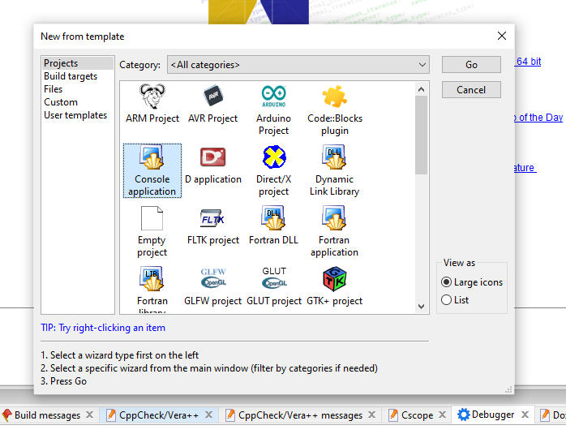

---

<style scoped>section{ font-size: 25px; }</style>

##### Code Blocks (Install / Compile / Run / Debug) (3)

Select `Console Application`

Click `Next` from Opening Window


---

<style scoped>section{ font-size: 25px; }</style>

##### Code Blocks (Install / Compile / Run / Debug) (4)

Select `C` for Sample Project


---

<style scoped>section{ font-size: 25px; }</style>

##### Code Blocks (Install / Compile / Run / Debug) (5)

Write a project name and title also set a project folder

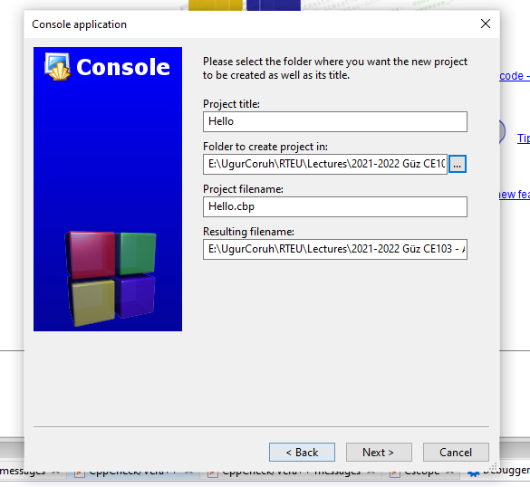

---

<style scoped>section{ font-size: 25px; }</style>

##### Code Blocks (Install / Compile / Run / Debug) (6)

Select a compiler for this project we selected `GCC` but you can select C compilers from the list. Set Debug and Release executable output folders.

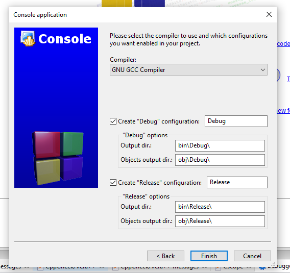

---

<style scoped>section{ font-size: 25px; }</style>

##### Code Blocks (Install / Compile / Run / Debug) (7)

- After this wizard, you will have the following code

```c
#include <stdio.h>
#include <stdlib.h>

int main()
{
    printf("Hello world!\n");
    return 0;
}
```

---

<style scoped>section{ font-size: 25px; }</style>

##### Code Blocks (Install / Compile / Run / Debug) (8)

Select `Debug` Build from the menu

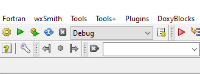

---

<style scoped>section{ font-size: 25px; }</style>

##### Code Blocks (Install / Compile / Run / Debug) (9)

Run with Build and Run `F9`


---

<style scoped>section{ font-size: 25px; }</style>

##### Code Blocks (Install / Compile / Run / Debug) (10)

- You should see the following output


---

<style scoped>section{ font-size: 25px; }</style>

##### Code Blocks (Install / Compile / Run / Debug) (11)

- Add the following lines to your source code for debugging

```c
#include <stdio.h>
#include <stdlib.h>

int main()
{
    printf("Hello world! Step-1\n");
    printf("Hello world! Step-2\n");
    printf("Hello world! Step-3\n");
    printf("Hello world! Step-4\n");
    printf("Hello world! Step-5\n");
    printf("Hello world! Step-6\n");
    return 0;
}
```

---

<style scoped>section{ font-size: 25px; }</style>

##### Code Blocks (Install / Compile / Run / Debug) (12)

- and add breakpoints with `F5` or mouse click

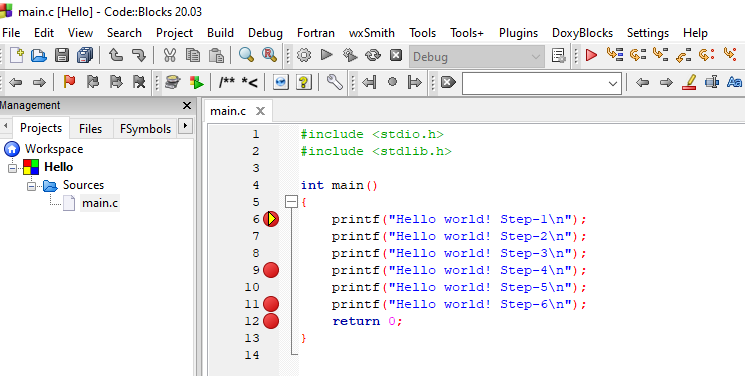

---

<style scoped>section{ font-size: 25px; }</style>

##### Code Blocks (Install / Compile / Run / Debug) (13)

- select `Debug->Start/Continue` to start debugger


---

<style scoped>section{ font-size: 25px; }</style>

##### Code Blocks (Install / Compile / Run / Debug) (14)

- If you see the following error this is related to long or turkish characters including the path. Just move the project to a shorter path and try again

```batch
Setting breakpoints
Debugger name and version: GNU gdb (GDB) 8.1
Starting the debuggee failed: No executable specified, use `target exec'.
Debugger finished with status 0
```

---

<style scoped>section{ font-size: 25px; }</style>

##### Code Blocks (Install / Compile / Run / Debug) (15)

You will see the following yellow pointer for the debugger


---

<style scoped>section{ font-size: 25px; }</style>

##### Code Blocks (Install / Compile / Run / Debug) (16)

You can use the following menu or shortcuts for step-by-step debugging.


---

<style scoped>section{ font-size: 25px; }</style>

#### GCC/G++ Complier (MinGW) / Clang-cl (LLVM) (1)

Download and install `MinGW` or `LLVM` compiler (if you downloaded then skip this step)

- MinGW installer (clang)

  - [Download MinGW-w64 - for 32 and 64-bit Windows from SourceForge.net](https://sourceforge.net/projects/mingw-w64/files/Toolchains%20targetting%20Win32/Personal%20Builds/mingw-builds/installer/mingw-w64-install.exe/download)

- If you have a problem try `Github`` builds

  - https://github.com/niXman/mingw-builds-binaries/releases
  - https://github.com/niXman/mingw-builds-binaries/releases/download/12.2.0-rt_v10-rev0/x86_64-12.2.0-release-win32-seh-rt_v10-rev0.7z

- LLVM installer (gcc/g++)

- [Download LLVM releases](https://releases.llvm.org/)

  - Also use the following notes
    - https://llvm.org/devmtg/2014-04/PDFs/Talks/clang-cl.pdf

---

<style scoped>section{ font-size: 25px; }</style>

#### GCC/G++ Complier (MinGW) / Clang-cl (LLVM) (2)

Open a console with "`cmd`" and test the following commands if commands are not recognized then set the system environment variable to add `gcc` and `g++` executable paths to the path variable (add to both system and user path variable)

```batch
gcc --version

g++ --version
```

```batch
C:\Users\ugur.coruh>gcc --version
gcc (x86_64-win32-seh-rev0, Built by MinGW-W64 project) 8.1.0
Copyright (C) 2018 Free Software Foundation, Inc.
This is free software; see the source for copying conditions.  There is NO
warranty; not even for MERCHANTABILITY or FITNESS FOR A PARTICULAR PURPOSE.
```

```batch
clang --version
```

---

<style scoped>section{ font-size: 25px; }</style>

#### GCC/G++ Complier (MinGW) / Clang-cl (LLVM) (3)

- for `gcc.exe`, `g++.exe` and `gdb.exe`

```bash
C:\Program Files\mingw-w64\x86_64-8.1.0-win32-seh-rt_v6-rev0\mingw64\bin
```

- for `clang.exe`, `lldb.exe`

```batch
C:\Program Files\LLVM\bin
```

This folder path changes according to your setup

---

<style scoped>section{ font-size: 25px; }</style>

### VSCode (Install / Compile / Run / Debug) (1)

Download Visual Studio Code from the following link

[Download Visual Studio Code - Mac, Linux, Windows](https://code.visualstudio.com/download)

---

<style scoped>section{ font-size: 25px; }</style>

#### VSCode (Install / Compile / Run / Debug) (2)

In this sample, you will find MinGW and LLVM compiler combinations for C and C++

Create a folder and enter this folder then open this folder with vscode by right click


---

<style scoped>section{ font-size: 25px; }</style>

#### VSCode (Install / Compile / Run / Debug) (3)

or enter the folder via console

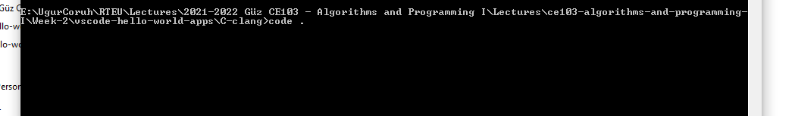

write

```batch
code .
```

---

<style scoped>section{ font-size: 25px; }</style>

#### VSCode (Install / Compile / Run / Debug) (4)

- This will open vscode for the current folder, (.) dot present current folder.
- You will see an empty folder in the right window


---

<style scoped>section{ font-size: 25px; }</style>

#### VSCode (Install / Compile / Run / Debug) (5)


---

<style scoped>section{ font-size: 25px; }</style>

#### VSCode (Install / Compile / Run / Debug) (6)

- Create a `hello.c` file and write the following content

```c
#include <stdio.h>
int main() {
   // printf() displays the string inside quotation
   printf("Hello, World!");
   return 0;
}
```

---

<style scoped>section{ font-size: 25px; }</style>

#### VSCode (Install / Compile / Run / Debug) (7)

use `CTRL+SHIFT+B` (you should be on the source code section) to build a file


---

<style scoped>section{ font-size: 25px; }</style>

#### VSCode (Install / Compile / Run / Debug) (8)

Select `GCC `or `CLANG `for this sample we can use `GCC`

You will see the output generated `Hello.exe``

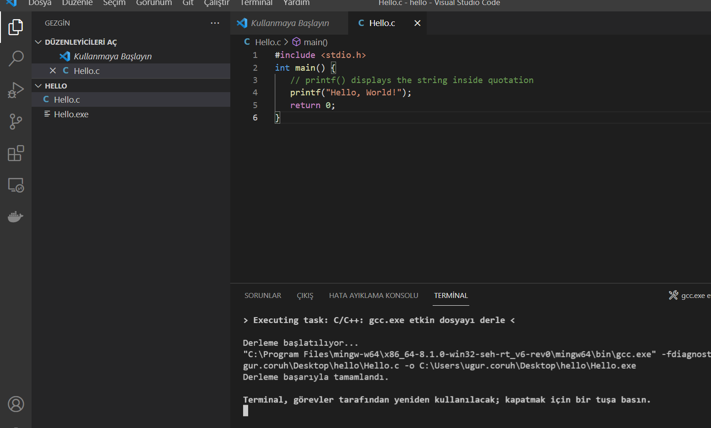

---

<style scoped>section{ font-size: 25px; }</style>

#### VSCode (Install / Compile / Run / Debug) (9)

for debugging just put a breakpoint and build again


---

<style scoped>section{ font-size: 25px; }</style>

#### VSCode (Install / Compile / Run / Debug) (10)

- after building for debug press `CTRL+SHIFT+D` (you should be in the source code section)and in the right window select create `launch.json`


---

<style scoped>section{ font-size: 25px; }</style>

#### VSCode (Install / Compile / Run / Debug) (11)

- from opening, window select `C++ GDB/LLDB`

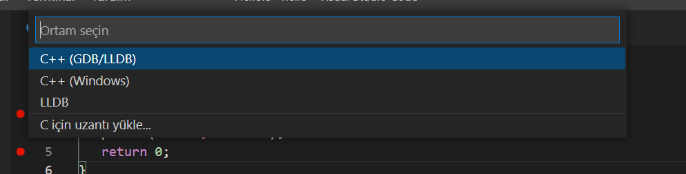

---

<style scoped>section{ font-size: 25px; }</style>

#### VSCode (Install / Compile / Run / Debug) (12)

- from the next opening, menu select `mingw-w64 gcc.exe`


---

<style scoped>section{ font-size: 25px; }</style>

#### VSCode (Install / Compile / Run / Debug) (13)

this will run the debugger and you will see debug points activated

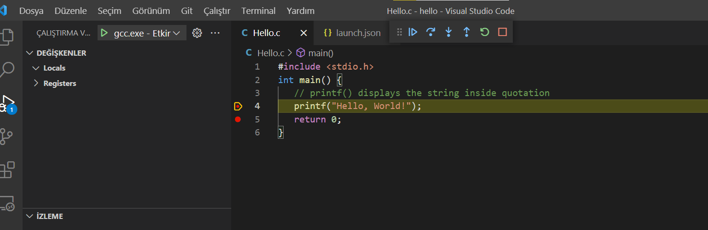

---

<style scoped>section{ font-size: 25px; }</style>

#### VSCode (Install / Compile / Run / Debug) (14)

then you can step-by-step debug your code.

the following `task.json` and `launch.json` automatically generated with your selections

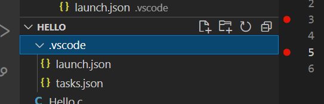

---

<style scoped>section{ font-size: 25px; }</style>

#### VSCode (Install / Compile / Run / Debug) (15)

**launch.json**

```json
{
  // Olası öznitelikler hakkında bilgi edinmek için IntelliSense kullanın.
  // Mevcut özniteliklerin açıklamalarını görüntülemek için üzerine gelin.
  // Daha fazla bilgi için şu adresi ziyaret edin: https://go.microsoft.com/fwlink/?linkid=830387
  "version": "0.2.0",
  "configurations": [
    {
      "name": "gcc.exe - Etkin dosyayı derle ve dosyada hata ayıkla",
      "type": "cppdbg",
      "request": "launch",
      "program": "${fileDirname}\\${fileBasenameNoExtension}.exe",
      "args": [],
      "stopAtEntry": false,
      "cwd": "${fileDirname}",
      "environment": [],
      "externalConsole": false,
      "MIMode": "gdb",
      "miDebuggerPath": "C:\\Program Files\\mingw-w64\\x86_64-8.1.0-win32-seh-rt_v6-rev0\\mingw64\\bin\\gdb.exe",
      "setupCommands": [
        {
          "description": "gdb için düzgün yazdırmayı etkinleştir",
          "text": "-enable-pretty-printing",
          "ignoreFailures": true
        }
      ],
      "preLaunchTask": "C/C++: gcc.exe etkin dosyayı derle"
    }
  ]
}
```

---

<style scoped>section{ font-size: 20px; }</style>

#### VSCode (Install / Compile / Run / Debug) (16)

**task.json**

```json
{
  "tasks": [
    {
      "type": "cppbuild",
      "label": "C/C++: gcc.exe etkin dosyayı derle",
      "command": "C:\\Program Files\\mingw-w64\\x86_64-8.1.0-win32-seh-rt_v6-rev0\\mingw64\\bin\\gcc.exe",
      "args": [
        "-fdiagnostics-color=always",
        "-g",
        "${file}",
        "-o",
        "${fileDirname}\\${fileBasenameNoExtension}.exe"
      ],
      "options": {
        "cwd": "${fileDirname}"
      },
      "problemMatcher": ["$gcc"],
      "group": {
        "kind": "build",
        "isDefault": true
      },
      "detail": "Hata Ayıklayıcısı tarafından oluşturulan görev."
    }
  ],
  "version": "2.0.0"
}
```

---

<style scoped>section{ font-size: 20px; }</style>

#### VSCode (Install / Compile / Run / Debug) (17)

- You can do the same thing for other compilers and C++ source codes. LLVM does not support debugging on vscode now.

for C++ VsCode you can check the following links

- for Windows

  - https://code.visualstudio.com/docs/cpp/config-mingw

- for Linux

  - https://code.visualstudio.com/docs/cpp/config-linux

- for WSL

  - https://code.visualstudio.com/docs/cpp/config-wsl

---

<style scoped>section{ font-size: 25px; }</style>

#### VSCode (Install / Compile / Run / Debug) (18)

in the launch file if you start debugging with `F5`

(you can select debugger with `CTRL+SHIFT+P` and then write Debug and Selecting Configure Debugger Option)

---

<style scoped>section{ font-size: 25px; }</style>

#### VSCode (Install / Compile / Run / Debug) (19)

- the following line will be your debugging application path

- if you start debugging with `F5 `in `Hello.c` file this will set `<Hello.c base path>/Hello.exe`

---

<style scoped>section{ font-size: 25px; }</style>

#### VSCode (Install / Compile / Run / Debug) (20)

You should set this correct for both `LLVM `and `GCC` configuration in launch.json

```bash
 "program": "${fileDirname}\\${fileBasenameNoExtension}.exe",
```

Also you should set your installed debugger paths

for GCC

```bash
"miDebuggerPath": "C:\\Program Files\\mingw-w64\\x86_64-8.1.0-win32-seh-rt_v6-rev0\\mingw64\\bin\\gdb.exe",
```

for LLVM

```bash
"miDebuggerPath": "C:\\Program Files\\LLVM\\bin\\lldb.exe",
```

for more details please check the sample source codes.

---

<style scoped>section{ font-size: 25px; }</style>

### Visual Studio Code Extension List (1)

> My Extension List

- Listing Installed Extensions

```bash
PS C:\Users\ugur.coruh\Desktop> code --list-extensions | % { "code --install-extension $_" }
```

Following topic can help you

[How can you export the Visual Studio Code extension list? - Stack Overflow](https://stackoverflow.com/questions/35773299/how-can-you-export-the-visual-studio-code-extension-list)

---

<style scoped>section{ font-size: 25px; }</style>

### Visual Studio Code Extension List (2)

```
code --install-extension 2gua.rainbow-brackets
code --install-extension aaron-bond.better-comments
code --install-extension abusaidm.html-snippets
code --install-extension ACharLuk.easy-cpp-projects
code --install-extension chris-noring.node-snippets
code --install-extension cschlosser.doxdocgen
code --install-extension csholmq.excel-to-markdown-table
code --install-extension DaChuiOpenSource.FreeMind
code --install-extension dannysteenman.cloudformation-yaml-snippets
code --install-extension Dart-Code.dart-code
code --install-extension Dart-Code.flutter
code --install-extension digized.umple
code --install-extension DotJoshJohnson.xml
code --install-extension DougFinke.vscode-pandoc
code --install-extension dzhavat.bracket-pair-toggler
code --install-extension esbenp.prettier-vscode
code --install-extension formulahendry.dotnet
code --install-extension franneck94.c-cpp-runner
code --install-extension gcc.
```

---

<style scoped>section{ font-size: 25px; }</style>

### Visual Studio Code Extension List (3)

```
vscode-plugin-billionbottle
code --install-extension geeklearningio.graphviz-markdown-preview
code --install-extension geyao.html-snippets
code --install-extension GitHub.copilot-nightly
code --install-extension GrapeCity.gc-excelviewer
code --install-extension Ionide.Ionide-fsharp
code --install-extension ionut-botizan.vscode-cypher-ql
code --install-extension ipedrazas.kubernetes-snippets
code --install-extension JakeWilson.vscode-picture
code --install-extension James-Yu.latex-workshop
code --install-extension JasonMejane.base64viewer
code --install-extension jasonnutter.search-node-modules
code --install-extension jebbs.plantuml
code --install-extension jeff-hykin.better-cpp-syntax
code --install-extension Katacoda.vscode
code --install-extension KenDomino.Antlrvsix-vscode
code --install-extension l7ssha.tag-inserter
code --install-extension lolkush.quickstart
code --install-extension marp-team.marp-vscode
code --install-extension mindaro-dev.file-downloader
code --install-extension mindaro.mindaro
code --install-extension ms-azuretools.vscode-docker
code --install-extension MS-CEINTL.vscode-language-pack-tr
```

---

<style scoped>section{ font-size: 25px; }</style>

### Visual Studio Code Extension List (4)

```
code --install-extension ms-dotnettools.csharp
code --install-extension ms-dotnettools.dotnet-interactive-vscode
code --install-extension ms-dotnettools.vscode-dotnet-pack
code --install-extension ms-dotnettools.vscode-dotnet-runtime
code --install-extension ms-kubernetes-tools.vscode-aks-tools
code --install-extension ms-kubernetes-tools.vscode-kubernetes-tools
code --install-extension ms-python.python
code --install-extension ms-python.vscode-pylance
code --install-extension ms-toolsai.jupyter
code --install-extension ms-toolsai.jupyter-keymap
code --install-extension ms-toolsai.jupyter-renderers
code --install-extension ms-vscode-remote.remote-containers
code --install-extension ms-vscode-remote.remote-ssh
code --install-extension ms-vscode-remote.remote-ssh-edit
code --install-extension ms-vscode-remote.remote-wsl
```

---

<style scoped>section{ font-size: 25px; }</style>

### Visual Studio Code Extension List (5)

```
code --install-extension ms-vscode.azure-account
code --install-extension ms-vscode.brackets-keybindings
code --install-extension ms-vscode.brackets-pack
code --install-extension ms-vscode.cmake-tools
code --install-extension ms-vscode.cpptools
code --install-extension ms-vscode.cpptools-extension-pack
code --install-extension ms-vscode.cpptools-themes
code --install-extension ms-vscode.live-server
code --install-extension ms-vsliveshare.vsliveshare
code --install-extension oleg-shilo.cs-script
code --install-extension PascalReitermann93.vscode-yaml-sort
```

---

<style scoped>section{ font-size: 25px; }</style>

### Visual Studio Code Extension List (6)

```
code --install-extension Pivotal.vscode-boot-dev-pack
code --install-extension Pivotal.vscode-concourse
code --install-extension Pivotal.vscode-manifest-yaml
code --install-extension Pivotal.vscode-spring-boot
code --install-extension PKief.material-icon-theme
code --install-extension platformio.platformio-ide
code --install-extension pranaygp.vscode-css-peek
code --install-extension redhat.fabric8-analytics
code --install-extension redhat.java
code --install-extension redhat.vscode-commons
code --install-extension redhat.vscode-xml
code --install-extension redhat.vscode-yaml
code --install-extension ritwickdey.LiveServer
code --install-extension sidthesloth.html5-boilerplate
code --install-extension TaodongWu.ejs-snippets
code --install-extension tht13.python
code --install-extension tomoki1207.pdf
code --install-extension twxs.cmake
code --install-extension vadimcn.vscode-lldb
```

---

<style scoped>section{ font-size: 25px; }</style>

### Visual Studio Code Extension List (7)

```
code --install-extension VisualStudioExptTeam.intellicode-api-usage-examples
code --install-extension VisualStudioExptTeam.vscodeintellicode
code --install-extension vscjava.vscode-java-debug
code --install-extension vscjava.vscode-java-dependency
code --install-extension vscjava.vscode-java-pack
code --install-extension vscjava.vscode-java-test
code --install-extension vscjava.vscode-maven
code --install-extension vscjava.vscode-spring-boot-dashboard
code --install-extension vscjava.vscode-spring-initializr
code --install-extension walkme.HTML5-extension-pack
code --install-extension webfreak.debug
code --install-extension well-ar.plantuml
code --install-extension wildboar.asn1
code --install-extension Zignd.html-css-class-completion
```

---

<style scoped>section{ font-size: 25px; }</style>

### Visual Studio Community Edition (Install / Compile / Run / Debug) (1)

- Download and install `Visual Studio Community Edition`
- Select All Development Environments from Installer.

[Ücretsiz Geliştirici Yazılımları ve Hizmetleri - Visual Studio](https://visualstudio.microsoft.com/tr/free-developer-offers/)


---

<style scoped>section{ font-size: 25px; }</style>

### Visual Studio Community Edition (Install / Compile / Run / Debug) (2)

- After installation open `Visual Studio `2022` from the menu.


---

<style scoped>section{ font-size: 25px; }</style>

### Visual Studio Community Edition (Install / Compile / Run / Debug) (3)

- The application will start...


---

<style scoped>section{ font-size: 25px; }</style>

### Visual Studio Community Edition (Install / Compile / Run / Debug) (4)

- From Opening Window Select `Create a new project`

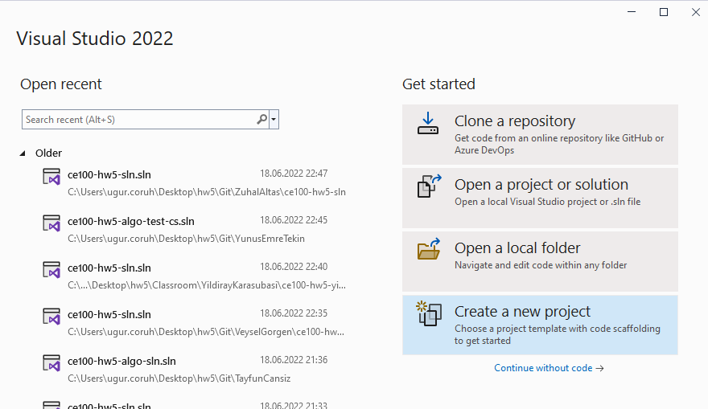

---

<style scoped>section{ font-size: 25px; }</style>

### Visual Studio Community Edition (Install / Compile / Run / Debug) (5)

- There will be several options, you can review them.

- Select `Windows`, `C++`, `Console Application` from Combobox.

- Select `Console Application`

  

---

<style scoped>section{ font-size: 25px; }</style>

### Visual Studio Community Edition (Install / Compile / Run / Debug) (6)

- Give a solution and project name.
- Select save location


---

<style scoped>section{ font-size: 25px; }</style>

### Visual Studio Community Edition (Install / Compile / Run / Debug) (7)

- You will have C++ basic Hello World application.

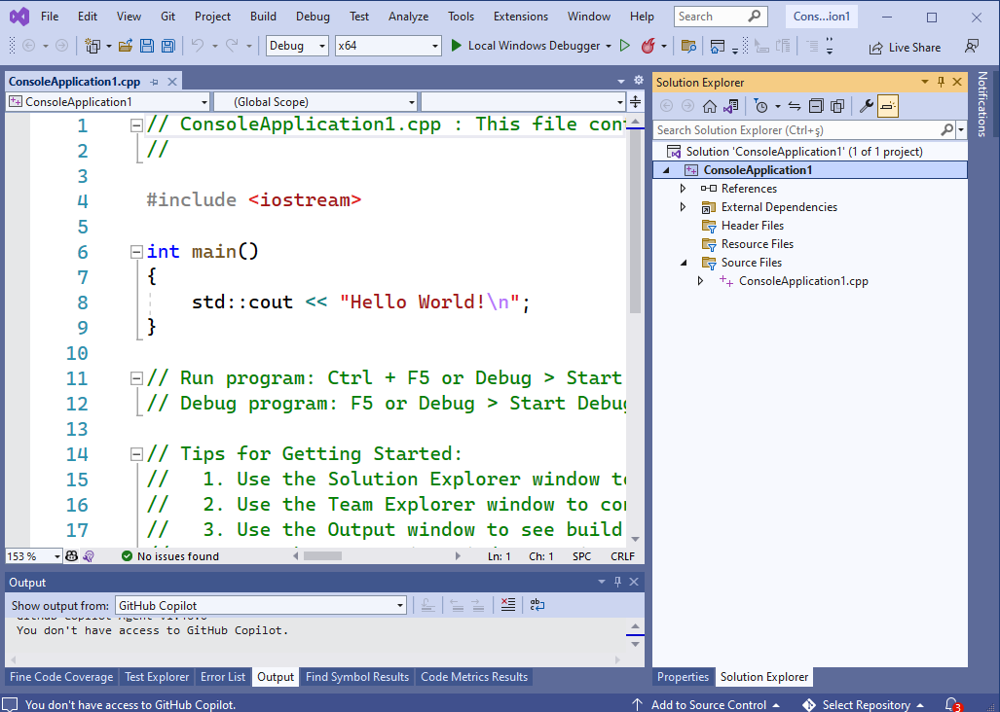

---

<style scoped>section{ font-size: 25px; }</style>

### Visual Studio Community Edition (Install / Compile / Run / Debug) (8)

- You will have C++ basic Hello World application.

```cpp
// ConsoleApplication1.cpp : This file contains the 'main' function. Program execution begins and ends there.
//

#include <iostream>

int main()
{
    std::cout << "Hello World!\n";
}

// Run program: Ctrl + F5 or Debug > Start Without Debugging menu
// Debug program: F5 or Debug > Start Debugging menu

// Tips for Getting Started:
//   1. Use the Solution Explorer window to add/manage files
//   2. Use the Team Explorer window to connect to source control
//   3. Use the Output window to see build output and other messages
//   4. Use the Error List window to view errors
//   5. Go to Project > Add New Item to create new code files, or Project > Add Existing Item to add existing code files to the project
//   6. In the future, to open this project again, go to File > Open > Project and select the .sln file
```

---

<style scoped>section{ font-size: 25px; }</style>

### Visual Studio Community Edition (Install / Compile / Run / Debug) (9)

- We need to rename the file extension to `c` from `cpp`


---

<style scoped>section{ font-size: 25px; }</style>

### Visual Studio Community Edition (Install / Compile / Run / Debug) (10)

- If you compile the source C compiler will be used.


---

<style scoped>section{ font-size: 25px; }</style>

### Visual Studio Community Edition (Install / Compile / Run / Debug) (11)

- We need to update our source for `C` as follows

```c
// ConsoleApplication1.c : This file contains the 'main' function. Program execution begins and ends there.
//

#include <stdio.h>

int main(){
    printf("Hello World!\n");
}
```

---

<style scoped>section{ font-size: 25px; }</style>

### Visual Studio Community Edition (Install / Compile / Run / Debug) (12)

- We need to update our source for `C` as follows

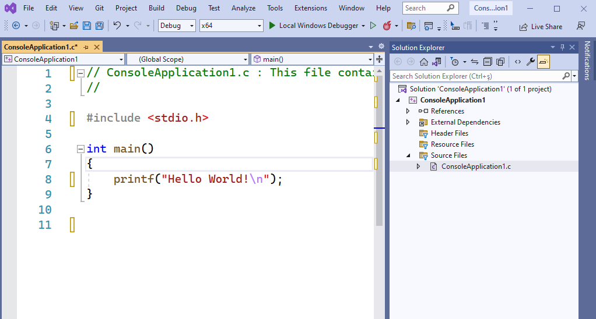

---

<style scoped>section{ font-size: 25px; }</style>

### Visual Studio Community Edition (Install / Compile / Run / Debug) (13)

- Put a breakpoint by clicking the following location. Breakpoints will be stop points for our debugging operations.

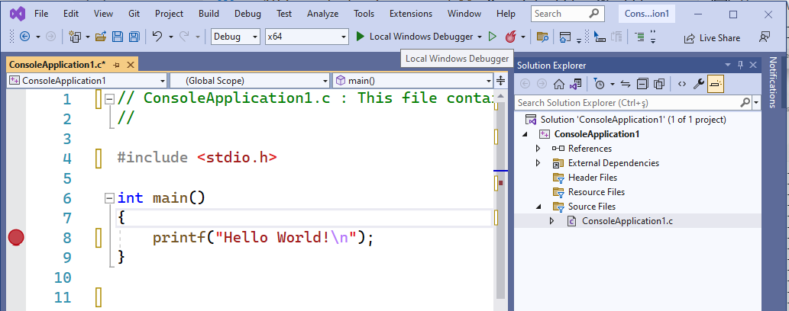

---

<style scoped>section{ font-size: 25px; }</style>

### Visual Studio Community Edition (Install / Compile / Run / Debug) (14)

- Then select Debug configuration and according to your operating system select x64 or x86 configuration and click `Local Windows Debugger`

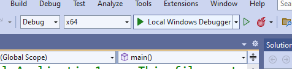

---

<style scoped>section{ font-size: 25px; }</style>

### Visual Studio Community Edition (Install / Compile / Run / Debug) (15)

- Update your source code as follow

```c
// ConsoleApplication1.c : This file contains the 'main' function. Program execution begins and ends there.
//

#include <stdio.h>

int sum(int input1, int input2);

int main(){
    int number = 5;
    printf("Before Increment : %d\n",number);
    number = sum(number, 5);
    printf("After Increment : %d\n", number);
}

int sum(int input1, int input2){
    return input1 + input2;
}
```

---

<style scoped>section{ font-size: 25px; }</style>

### Visual Studio Community Edition (Install / Compile / Run / Debug) (16)

- Put the following breakpoints and run the debugger. On number, the variable pins the variable to see its value in real-time.

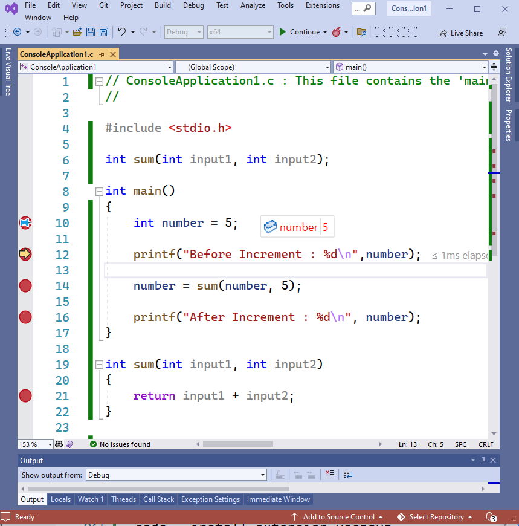

---

<style scoped>section{ font-size: 25px; }</style>

### Visual Studio Community Edition (Install / Compile / Run / Debug) (17)

- Open Debug->Windows->Memory->Memory1 to see value in memory

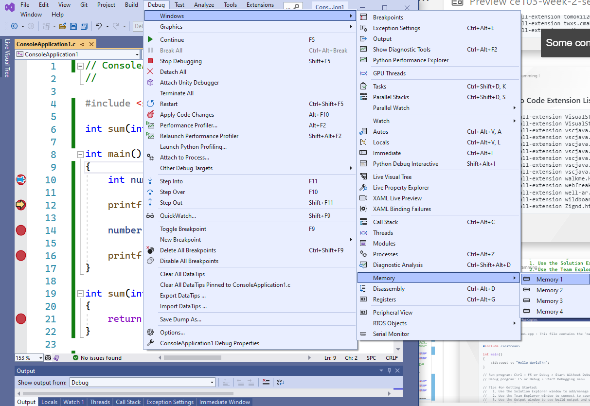

---

<style scoped>section{ font-size: 25px; }</style>

### Visual Studio Community Edition (Install / Compile / Run / Debug) (18)

- In the memory window copy variable name (number) with address operator (&) and then (&number) press enter.


---

<style scoped>section{ font-size: 25px; }</style>

### Visual Studio Community Edition (Install / Compile / Run / Debug) (19)

- You can see its value in memory with hexadecimal form (`05 00 00 00`)

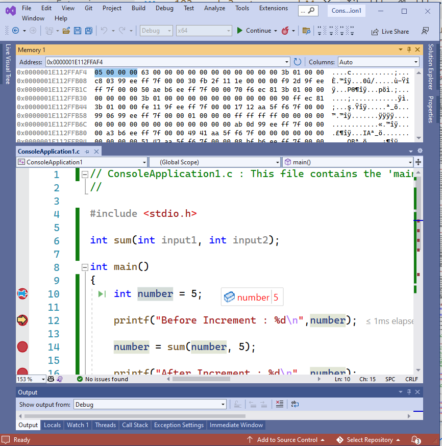

---

<style scoped>section{ font-size: 25px; }</style>

### Visual Studio Community Edition (Install / Compile / Run / Debug) (20)

- If you change value with pinned control your memory value and your current value will be updated. 20 in hexadecimal 0x14 (integer is 4 bytes length for this reason memory shows `14 00 00 00`)

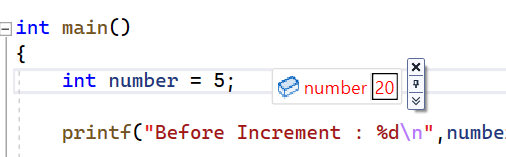

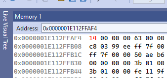

---

<style scoped>section{ font-size: 25px; }</style>

### Visual Studio Community Edition (Install / Compile / Run / Debug) (21)

- If you close some windows such as solution explorer, and properties windows you can open them from the View menu.

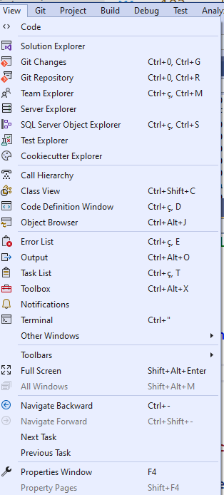

---

<style scoped>section{ font-size: 25px; }</style>

### Visual Studio Community Edition (Install / Compile / Run / Debug) (22)

- Solution and Projects have several configurations for each setup such as Release - x86, Release-x64, Debug- x86, and Debug-x64 you need to configure all of them for your requirements. You can access configurations by right-clicking to project and then selecting properties.


---

<style scoped>section{ font-size: 25px; }</style>

### Visual Studio Community Edition (Install / Compile / Run / Debug) (23)

- Project properties has several settings

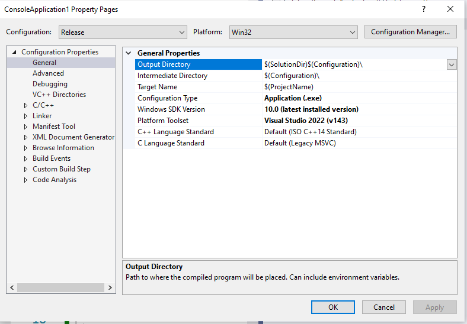

---

<style scoped>section{ font-size: 25px; }</style>

#### Notepad++ (Install / Compile ) (1)


- Please download Notepad++ from the following link
  - [Downloads | Notepad&#43;&#43;](https://notepad-plus-plus.org/downloads/)

---

<style scoped>section{ font-size: 25px; }</style>

#### Notepad++ (Install / Compile ) (2)

Download and install MinGW or LLVM compiler (if you downloded then skip this step)

**MinGW installer (gcc / g++)**

- A complete runtime environment for gcc
  - https://sourceforge.net/projects/mingw-w64/
  - https://sourceforge.net/projects/mingw-w64/files/latest/download
- w64devkit is a portable C and C++ development kit for x64 (and x86) Windows.
  - https://www.mingw-w64.org/downloads/#w64devkit
- Also, see the following notes
  - https://www.hanshq.net/building-gcc.html

---

<style scoped>section{ font-size: 25px; }</style>

#### Notepad++ (Install / Compile ) (3)

**LLVM installer (clang)**

- Download
  - https://releases.llvm.org/
- Also, use the following notes
  - https://llvm.org/devmtg/2014-04/PDFs/Talks/clang-cl.pdf
  - https://www.hanshq.net/clang-plugin-example.html

---

<style scoped>section{ font-size: 25px; }</style>

#### Notepad++ (Install / Compile ) (4)

Open a console with "`cmd`" and test the following commands if commands are not recognized then set the system environment variable to add `gcc` and `g++` executable paths to the path variable (add to both system and user path variable)

```batch
gcc --version

g++ --version
```

```batch
C:\Users\ugur.coruh>gcc --version
gcc (x86_64-win32-seh-rev0, Built by MinGW-W64 project) 8.1.0
Copyright (C) 2018 Free Software Foundation, Inc.
This is free software; see the source for copying conditions.  There is NO
warranty; not even for MERCHANTABILITY or FITNESS FOR A PARTICULAR PURPOSE.
```

---

<style scoped>section{ font-size: 25px; }</style>

#### Notepad++ (Install / Compile ) (5)

- Open system environments to update path variable for gcc/g++ and clang

  

---

<style scoped>section{ font-size: 25px; }</style>

#### Notepad++ (Install / Compile ) (6)

- Open "Environment Variables"


---

<style scoped>section{ font-size: 25px; }</style>

#### Notepad++ (Install / Compile ) (7)

- Select path variable from user section.


---

<style scoped>section{ font-size: 25px; }</style>

#### Notepad++ (Install / Compile ) (8)

- Select path variable from system section.
  

---

<style scoped>section{ font-size: 25px; }</style>

#### Notepad++ (Install / Compile ) (9)

- Update variables add `MinGW` and `LLVM` to path `gcc.exe` `g++.exe` `clang.exe` will be in bin folders. Then we can run this commands from command line.


---

<style scoped>section{ font-size: 25px; }</style>

#### Notepad++ (Install / Compile ) (9)

- Update variables add `MinGW` and `LLVM` to path `gcc.exe` `g++.exe` `clang.exe` will be in bin folders. Then we can run this commands from command line.


---

<style scoped>section{ font-size: 25px; }</style>

#### Notepad++ (Install / Compile ) (10)

- for `gcc.exe`, `g++.exe` and `gdb.exe`

```bash
C:\Program Files\mingw-w64\x86_64-8.1.0-win32-seh-rt_v6-rev0\mingw64\bin
```

---

<style scoped>section{ font-size: 25px; }</style>

#### Notepad++ (Install / Compile ) (11)

- for `clang.exe` , `lldb.exe` we will use the following path

```batch
C:\Program Files\LLVM\bin
```

---

<style scoped>section{ font-size: 25px; }</style>

#### Notepad++ (Install / Compile ) (12)

- This folder paths changes according to your setup

- Open `NppExec` extension (install from extension manager if not exist)


---

<style scoped>section{ font-size: 25px; }</style>

#### Notepad++ (Install / Compile ) (13)

- Write the following commands in the box

```batch
NPP_SAVE // save current file
cd $(CURRENT_DIRECTORY) // go to directory of the current file
gcc  -Wall -Wextra -Wpedantic -std=c++11 -o "$(NAME_PART)" "$(FILE_NAME)"
```


---

<style scoped>section{ font-size: 25px; }</style>

#### Notepad++ (Install / Compile ) (14)

- Save the script as `gcc-build` and for more information check the following link

- You can modify or add multiple scripts for another task.

---

<style scoped>section{ font-size: 25px; }</style>

### MSYS2

- Software Distribution and Building Platform for Windows

https://www.msys2.org/

---

<style scoped>section{ font-size: 25px; }</style>

#### Vi/Vim (C/C++) for Windows (1)

- Vim is a command-line editor for programming
- Use the following links to download Vim for Windows
  - https://github.com/vim/vim-win32-installer/releases
  - [download : vim online](https://www.vim.org/download.php)

---

<style scoped>section{ font-size: 25px; }</style>

#### Vi/Vim (C/C++) for Windows (2)

- Run setup to install the application on your computer.


---

<style scoped>section{ font-size: 25px; }</style>

#### Vi/Vim (C/C++) for Windows (3)

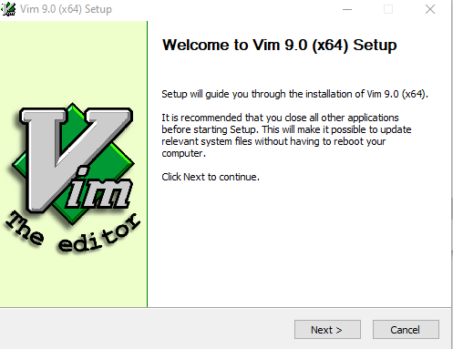

---

<style scoped>section{ font-size: 25px; }</style>

#### Vi/Vim (C/C++) for Windows (4)

- Installation steps.


---

<style scoped>section{ font-size: 25px; }</style>

#### Vi/Vim (C/C++) for Windows (5)

- Installation steps.

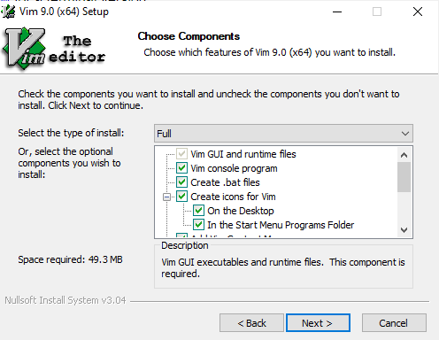

---

<style scoped>section{ font-size: 25px; }</style>

#### Vi/Vim (C/C++) for Windows (6)

- Installation steps.

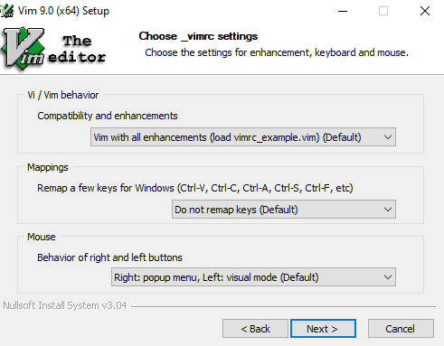

---

<style scoped>section{ font-size: 25px; }</style>

#### Vi/Vim (C/C++) for Windows (7)

- Installation steps.


---

<style scoped>section{ font-size: 25px; }</style>

#### Vi/Vim (C/C++) for Windows (8)

- Installation steps.


---

<style scoped>section{ font-size: 25px; }</style>

#### Vi/Vim (C/C++) for Windows (9)

- Installation steps.

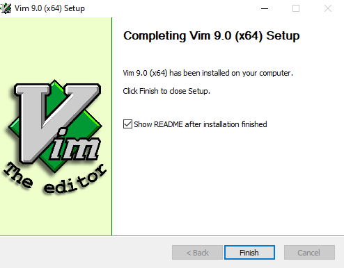

---

<style scoped>section{ font-size: 25px; }</style>

#### Vi/Vim (C/C++) for Windows (10)

- Generated shortcuts on your desktop

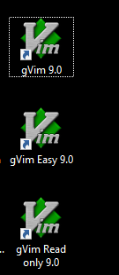

---

<style scoped>section{ font-size: 25px; }</style>

#### Vi/Vim (C/C++) for Windows (11)

- Run `vim hello.c` on your command-line to open a c file with vim editor.


---

<style scoped>section{ font-size: 25px; }</style>

#### Vi/Vim (C/C++) for Windows (12)

- You will have the following editor.
- Use INSERT to change edit options.

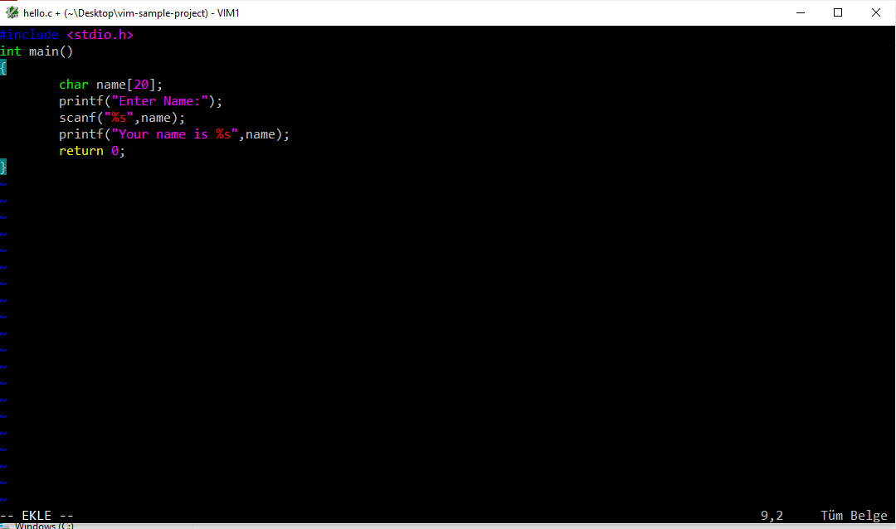

---

<style scoped>section{ font-size: 25px; }</style>

#### Vi/Vim (C/C++) for Windows (13)

- Sample source code

```c
#include <stdio.h>
int main()
{
    char name[20];
    printf("Enter Name:");
    scanf("%s",name);
    printf("Your name is %s",name);
    return 0;
}
```

---

<style scoped>section{ font-size: 25px; }</style>

#### Vi/Vim (C/C++) for Windows (14)

- Write source code
- Press the ` Esc` button to enter command mode
- Then type `:wq`. It will save the file and exit from Vim
  - w: write
  - q: quit

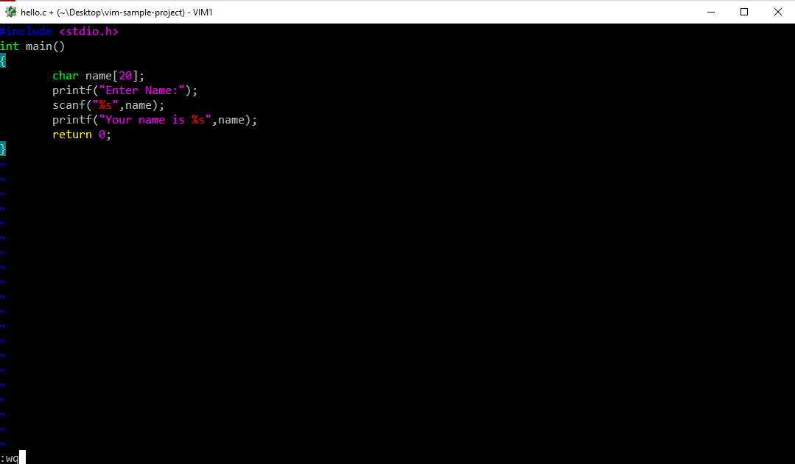

---

<style scoped>section{ font-size: 25px; }</style>

#### Vi/Vim (C/C++) for Windows (15)

- compile source code with `gcc`
- link the objects and
- run executable


---

<style scoped>section{ font-size: 25px; }</style>

#### Vi/Vim (C/C++) for Windows (17)

- In the folder, you can find your executable. `hello.exe`

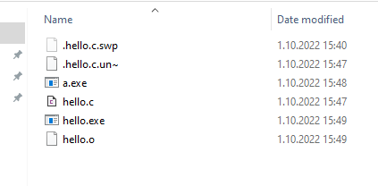

---

<style scoped>section{ font-size: 25px; }</style>

#### Vi/Vim (C/C++) for Windows (16)

- compile, link and execute flow will be as follow;

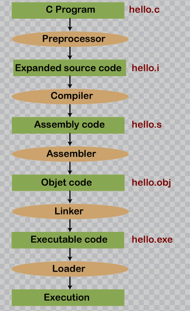

---

<style scoped>section{ font-size: 25px; }</style>

#### Eclipse (C/C++) - Compile Only / Debugging Has Problem (1)

- Download and install Eclipse IDE from the following link
  - [Eclipse IDE for C/C++ Developers | Eclipse Packages](https://www.eclipse.org/downloads/packages/release/kepler/sr2/eclipse-ide-cc-developers)
- Run Installer
- Select `Eclipse IDE for C/C++ Developers`


---

<style scoped>section{ font-size: 25px; }</style>

#### Eclipse (C/C++) - Compile Only / Debugging Has Problem (2)

- Select Java Version and Installation Path


---

<style scoped>section{ font-size: 25px; }</style>

#### Eclipse (C/C++) - Compile Only / Debugging Has Problem (3)

- After installation you can LAUNCH eclipse IDE


---

<style scoped>section{ font-size: 25px; }</style>

#### Eclipse (C/C++) - Compile Only / Debugging Has Problem (4)


---

<style scoped>section{ font-size: 25px; }</style>

#### Eclipse (C/C++) - Compile Only / Debugging Has Problem (5)

- Select a workspace that your project will be saved


---

<style scoped>section{ font-size: 25px; }</style>

#### Eclipse (C/C++) - Compile Only / Debugging Has Problem (6)

- You can find your installation under your user folder


---

<style scoped>section{ font-size: 25px; }</style>

#### Eclipse (C/C++) - Compile Only / Debugging Has Problem (7)

- You can create shortcut to desktop for your working eclipse version.

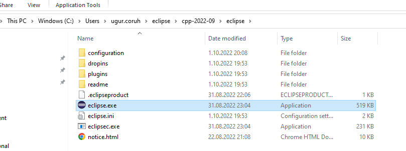

---

<style scoped>section{ font-size: 25px; }</style>

#### Eclipse (C/C++) - Compile Only / Debugging Has Problem (8)

- File -> New -> Project

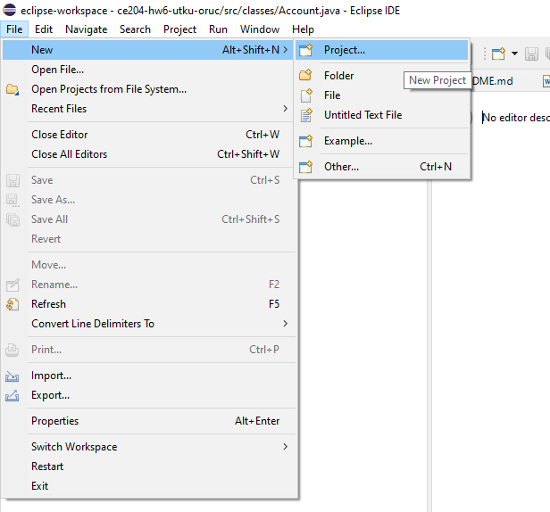

---

<style scoped>section{ font-size: 25px; }</style>

#### Eclipse (C/C++) - Compile Only / Debugging Has Problem (9)

- Select C/C++ Project


---

<style scoped>section{ font-size: 25px; }</style>

#### Eclipse (C/C++) - Compile Only / Debugging Has Problem (10)

- Select C Managed Build, Eclipse CDT will do job for us.


---

<style scoped>section{ font-size: 25px; }</style>

#### Eclipse (C/C++) - Compile Only / Debugging Has Problem (11)

- Give project name and select a basic template executable with MinGW GCC.


---

<style scoped>section{ font-size: 25px; }</style>

#### Eclipse (C/C++) - Compile Only / Debugging Has Problem (12)

- Configura Basic Settings


---

<style scoped>section{ font-size: 25px; }</style>

#### Eclipse (C/C++) - Compile Only / Debugging Has Problem (13)

- There are default Debug and Release configurations you can add your customized configurations from Advanced Settings.

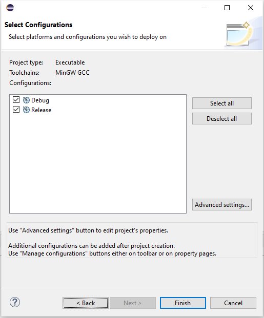

---

<style scoped>section{ font-size: 25px; }</style>

#### Eclipse (C/C++) - Compile Only / Debugging Has Problem (14)

- Project settings will be C Select Debug/Release configuration and then Build Application Project->Build All (Ctrl+B)

- HelloWorldC.exe will be generated

```bash
gcc -O0 -g3 -Wall -c -fmessage-length=0 -o "src\\HelloWorldC.o" "..\\src\\HelloWorldC.c"
gcc -o HelloWorldC.exe "src\\HelloWorldC.o"
```


---

<style scoped>section{ font-size: 25px; }</style>

#### Eclipse (C/C++) - Compile Only / Debugging Has Problem (15)

- Before build if you want to debug application select debug configuration, put your breakpoints and then Build application again.

- Right click the generated executable Debug As -> Local C/C++ Application


---

<style scoped>section{ font-size: 25px; }</style>

#### Eclipse (C/C++) - Compile Only / Debugging Has Problem (16)

- Debugger will start and stop at breakpoint as follow.


---

<style scoped>section{ font-size: 25px; }</style>

#### Eclipse (C/C++) - Compile Only / Debugging Has Problem (16)

- Check debug control shortcuts and use them

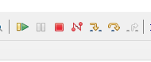

---

<style scoped>section{ font-size: 25px; }</style>

#### Eclipse (C/C++) - Compile Only / Debugging Has Problem (17)

- To watch variables use Expressions and Variables

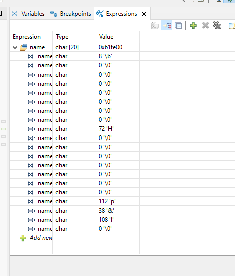

---

<style scoped>section{ font-size: 25px; }</style>

#### Eclipse (C/C++) - Compile Only / Debugging Has Problem (18)


---

<style scoped>section{ font-size: 25px; }</style>

#### Eclipse (C/C++) - Compile Only / Debugging Has Problem (19)

- for more visit eclipse webpage

  - [Effective Techniques for Debugging C & C++ | The Eclipse Foundation](https://www.eclipse.org/community/eclipse_newsletter/2017/april/article2.php)

  - [Help - Eclipse IDE](https://rtist.hcldoc.com/help/index.jsp?topic=%2Forg.eclipse.cdt.doc.user%2Fgetting_started%2Fcdt_w_debug.htm)

---

<style scoped>section{ font-size: 25px; }</style>

#### Eclipse (C/C++) - Compile Only / Debugging Has Problem (20)

- Generate CMAKE project from new Project and Select CMake Project Template


---

<style scoped>section{ font-size: 25px; }</style>

#### Eclipse (C/C++) - Compile Only / Debugging Has Problem (21)

- Give project name

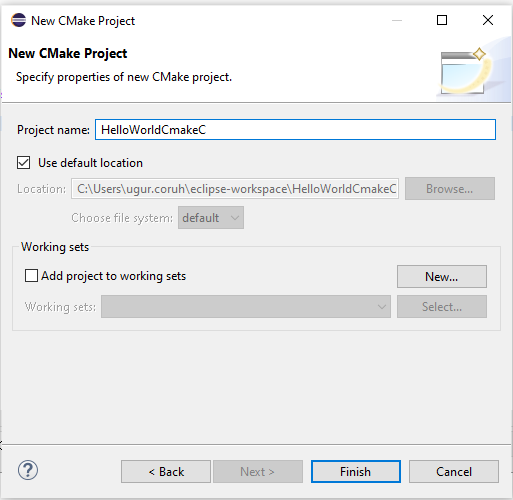

---

<style scoped>section{ font-size: 25px; }</style>

#### Eclipse (C/C++) - Compile Only / Debugging Has Problem (22)

- This will generate default C++ Hello World project


---

<style scoped>section{ font-size: 25px; }</style>

#### Eclipse (C/C++) - Compile Only / Debugging Has Problem (23)

- Build Project


---

<style scoped>section{ font-size: 25px; }</style>

#### Eclipse (C/C++) - Compile Only / Debugging Has Problem (24)

- It will give following errors, for missing configurations. This errors are generated by CMAKE

- Then clean and rebuild again.

```tex
Errors occurred during the build.
Errors running builder 'CDT Core Builder' on project 'HelloWorldCmakeC'.
Resource '/HelloWorldCmakeC/build/cmake.debug.win32.x86_64/compile_commands.json' does not exist.
Resource '/HelloWorldCmakeC/build/cmake.debug.win32.x86_64/compile_commands.json' does not exist.
Resource '/HelloWorldCmakeC/build/cmake.debug.win32.x86_64/compile_commands.json' does not exist.
Resource '/HelloWorldCmakeC/build/cmake.debug.win32.x86_64/compile_commands.json' does not exist.
```

---

<style scoped>section{ font-size: 25px; }</style>

#### Eclipse (C/C++) - Compile Only / Debugging Has Problem (25)

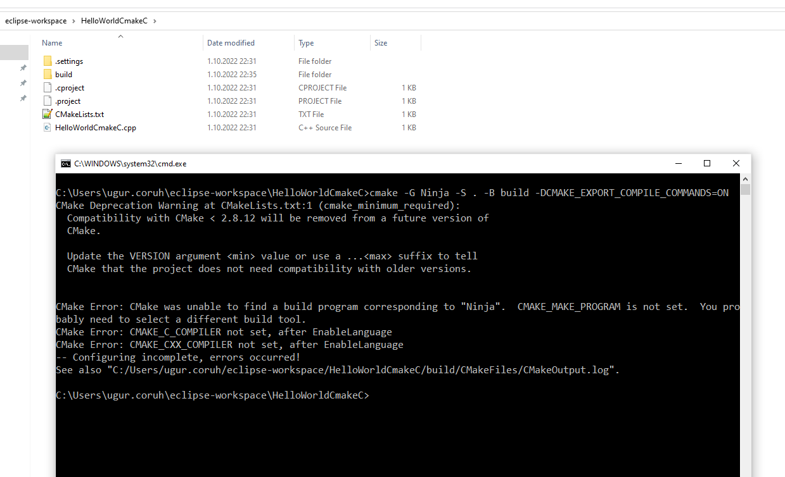

---

<style scoped>section{ font-size: 25px; }</style>

#### Eclipse (C/C++) - Compile Only / Debugging Has Problem (26)

- After this operation first Clean project from Project menu and then Build All again

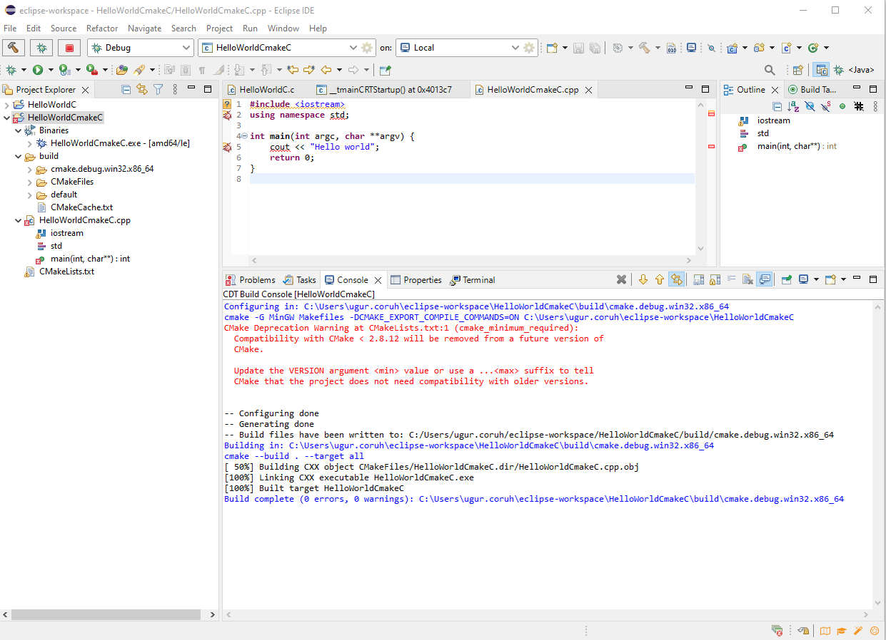

---

<style scoped>section{ font-size: 25px; }</style>

#### Eclipse (C/C++) - Compile Only / Debugging Has Problem (27)

- [Eclipse with CMake project on windows](https://yairgadelov.me/eclipse-with-cmake-project-on-windows/)

- [JV - Science and stuff.](https://jvgomez.github.io/pages/how-to-configure-a-cc-project-with-eclipse-and-cmake.html)

---

<style scoped>section{ font-size: 25px; }</style>

#### Eclipse (C/C++) - Compile Only / Debugging Has Problem (28)


---

<style scoped>section{ font-size: 25px; }</style>

#### Eclipse (C/C++) - Compile Only / Debugging Has Problem (29)


---

<style scoped>section{ font-size: 25px; }</style>

#### Netbeans (C/C++) - Manuel Build/Clean/Run Command Setting Not Good Option for C/C++ Development (1)

- https://netbeans.apache.org/

- [C and C++ Tutorials](https://netbeans.apache.org/kb/docs/cnd/)

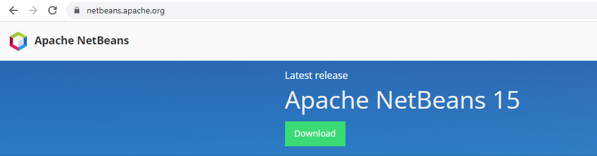

---

<style scoped>section{ font-size: 25px; }</style>

#### Netbeans (C/C++) - Manuel Build/Clean/Run Command Setting Not Good Option for C/C++ Development (2)

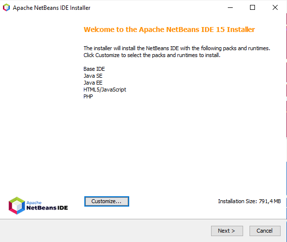

---

<style scoped>section{ font-size: 25px; }</style>

#### Netbeans (C/C++) - Manuel Build/Clean/Run Command Setting Not Good Option for C/C++ Development (3)


---

<style scoped>section{ font-size: 25px; }</style>

#### Netbeans (C/C++) - Manuel Build/Clean/Run Command Setting Not Good Option for C/C++ Development (4)


---

<style scoped>section{ font-size: 25px; }</style>

#### Netbeans (C/C++) - Manuel Build/Clean/Run Command Setting Not Good Option for C/C++ Development (5)


---

<style scoped>section{ font-size: 25px; }</style>

#### Netbeans (C/C++) - Manuel Build/Clean/Run Command Setting Not Good Option for C/C++ Development (6)

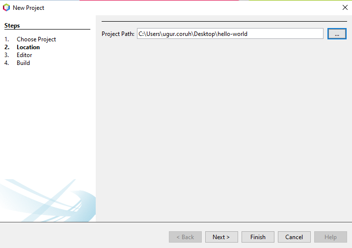

---

<style scoped>section{ font-size: 25px; }</style>

#### Netbeans (C/C++) - Manuel Build/Clean/Run Command Setting Not Good Option for C/C++ Development (7)


---

<style scoped>section{ font-size: 25px; }</style>

#### Netbeans (C/C++) - Manuel Build/Clean/Run Command Setting Not Good Option for C/C++ Development (8)

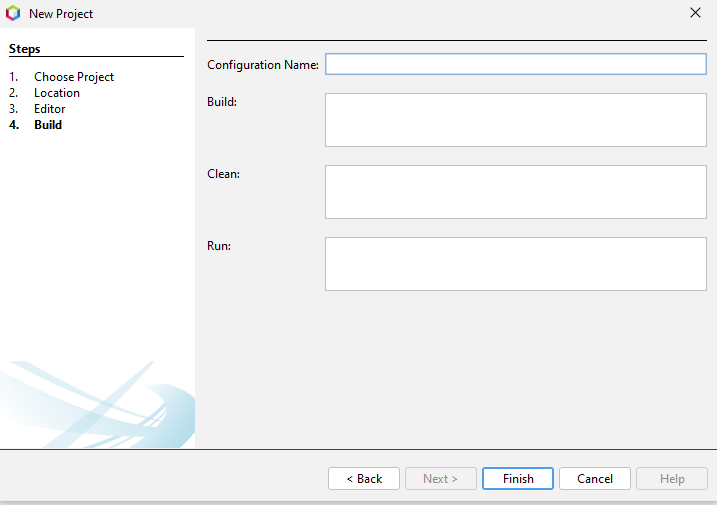

---

<style scoped>section{ font-size: 25px; }</style>

#### Turbo C/C++ (1)

Download [Turbo.C.3.2.zip](files/Turbo.C.3.2.zip)

- [Download Turbo C++ for Windows 7, 8, 8.1, 10 and Windows 11 (32-64 bit) with full/window screen mode and many more extra features](https://developerinsider.co/download-turbo-c-for-windows-7-8-8-1-and-windows-10-32-64-bit-full-screen/)

- [Turbo C++ Shortcuts - C Programming Language Tutorials](https://developerinsider.co/turbo-c-shortcuts/)

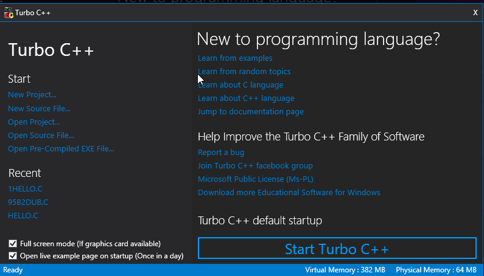

---

<style scoped>section{ font-size: 25px; }</style>

#### Turbo C/C++ (2)

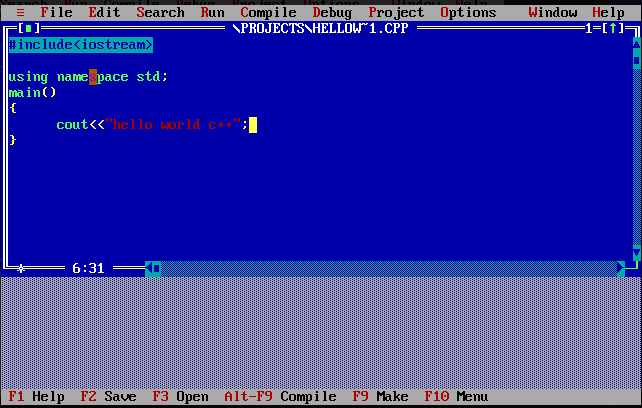

---

<style scoped>section{ font-size: 25px; }</style>

#### Cmake (C++/C) (1)

**CMake** (http://www.cmake.org/) is a program which generates the **Makefiles** used by **Make**.

---

<style scoped>section{ font-size: 25px; }</style>

#### Cmake (C++/C) (2)

Why use **CMake** ?

- Eases **Make** use
  - but the same way of thinking
  - generate the **Makefile**
- Separate the compilation from the sources
- Multi-platfoms
- Very flexible

---

<style scoped>section{ font-size: 25px; }</style>

#### Cmake (C++/C) (3)

- Check if the libraries/programs are available on your system
- File generator (**configure_file**)
- Calling programs or scripts (**doxygen**)
- One of the new standards

---

<style scoped>section{ font-size: 25px; }</style>

#### Cmake (C++/C) (4) (Download and Install)

use the following link for download

[Download | CMake](https://cmake.org/download/)

---

<style scoped>section{ font-size: 25px; }</style>

#### Cmake (C++/C) (5) (WSL and Linux Environment)

[Hello world with CMake](https://lappweb.in2p3.fr/~paubert/ASTERICS_HPC/2-2-100.html)

---

<style scoped>section{ font-size: 25px; }</style>

#### Cmake (C++/C) (6) (Windows Environment)

**main.c**

```c
#include <stdio.h>
int main()
{
    char name[20];
    printf("Enter name: ");
    scanf("%s", name);
    printf("Your name is %s.", name);
    return 0;
}
```

**CMakeLists.txt**

```cmake
cmake_minimum_required(VERSION 3.7.2)
project(scanf-sample)
add_executable(scanf-sample main.c)
```

---

<style scoped>section{ font-size: 25px; }</style>

#### Cmake (C++/C) (7) (Windows Environment)

put main.c and CMakeLists.txt file in sample-scanf folder and from command line


run the following cmake command with dot (.) to create solution file for c project

```batch
C:\Users\ugur.coruh\Desktop\sample-scanf>cmake .
```

---

<style scoped>section{ font-size: 25px; }</style>

#### Cmake (C++/C) (8) (Windows Environment)

I have Visual Studio 2022 Community Edition Installed on My Computer, for these reason build tools are selected for visual studio environment and the following outputs are generated

```batch
C:\Users\ugur.coruh\Desktop\sample-scanf>cmake .
-- Building for: Visual Studio 17 2022
-- Selecting Windows SDK version 10.0.22000.0 to target Windows 10.0.19043.
-- The C compiler identification is MSVC 19.30.30704.0
-- The CXX compiler identification is MSVC 19.30.30704.0
-- Detecting C compiler ABI info
-- Detecting C compiler ABI info - done
-- Check for working C compiler: C:/Program Files/Microsoft Visual Studio/2022/Community/VC/Tools/MSVC/14.30.30704/bin/Hostx64/x64/cl.exe - skipped
-- Detecting C compile features
-- Detecting C compile features - done
-- Detecting CXX compiler ABI info
-- Detecting CXX compiler ABI info - done
-- Check for working CXX compiler: C:/Program Files/Microsoft Visual Studio/2022/Community/VC/Tools/MSVC/14.30.30704/bin/Hostx64/x64/cl.exe - skipped
-- Detecting CXX compile features
-- Detecting CXX compile features - done
-- Configuring done
-- Generating done
-- Build files have been written to: C:/Users/ugur.coruh/Desktop/sample-scanf

C:\Users\ugur.coruh\Desktop\sample-scanf>
```

---

<style scoped>section{ font-size: 25px; }</style>

#### Cmake (C++/C) (9) (Windows Environment)

also following files are generated

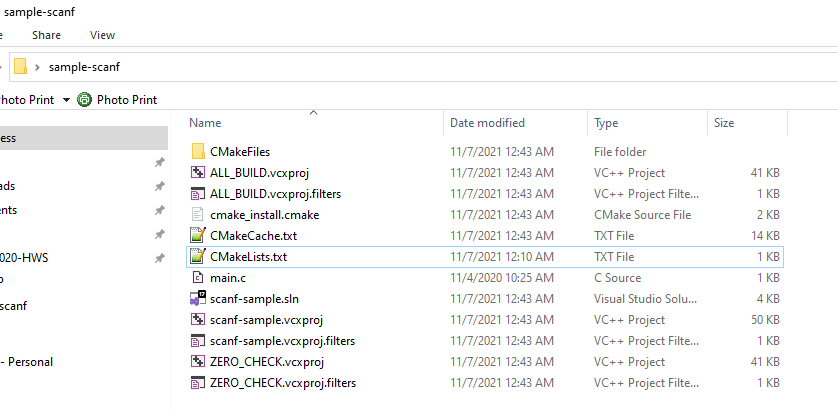

---

<style scoped>section{ font-size: 25px; }</style>

#### Cmake (C++/C) (10) (Windows Environment)

if we open scanf-sample.sln file we will have automated generated project files

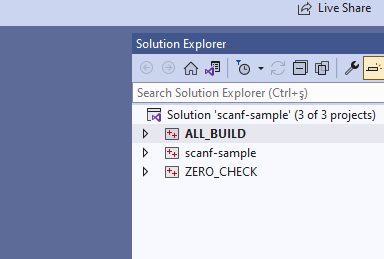

---

<style scoped>section{ font-size: 25px; }</style>

#### Cmake (C++/C) (11) (Windows Environment)

you can make scanf-sample with startup project with right click and then run on visual studio.

if you want to configure for another build tool you can use Cmake-GUI installed with setup on your computer


---

<style scoped>section{ font-size: 25px; }</style>

#### Cmake (C++/C) (12) (Windows Environment)

Open GUI and Select _File-> Delete Cache_


---

<style scoped>section{ font-size: 25px; }</style>

#### Cmake (C++/C) (13) (Windows Environment)

then you can click "Configure" to select build tool

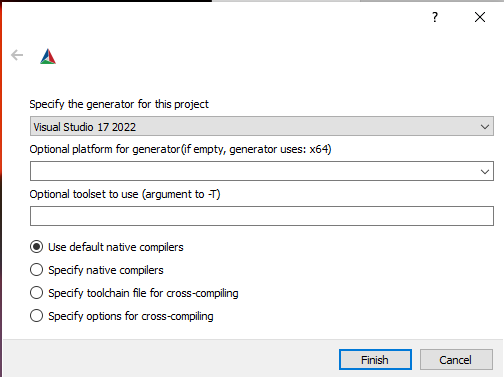

---

<style scoped>section{ font-size: 25px; }</style>

#### Cmake (C++/C) (14) (Windows Environment)


---

<style scoped>section{ font-size: 25px; }</style>

#### Cmake (C++/C) (15) (Windows Environment)

if you click "Configure" twice it will generate the visual studio solution in build folder

for more detailed examples that include also docker and travis-ci sample you can check the following repo

[GitHub - ttroy50/cmake-examples: Useful CMake Examples](https://github.com/ttroy50/cmake-examples)

---

<style scoped>section{ font-size: 25px; }</style>

#### Make (1)

Sample

**hello.c**

```c
#include <stdio.h>

int main(void)
{
    printf("hello, world\n");
}
```

---

<style scoped>section{ font-size: 25px; }</style>

#### Make (2)

**Makefile**

```makefile
# This is the default target, which will be built when
# you invoke make
.PHONY: all
all: hello

# This rule tells make how to build hello from hello.cpp
hello: hello.c
    g++ -o hello hello.c

# This rule tells make to copy hello to the binaries subdirectory,
# creating it if necessary
.PHONY: install
install:
    mkdir -p binaries
    cp -p hello binaries

# This rule tells make to delete hello and hello.o
.PHONY: clean
clean:
    rm -f hello
```

---

<style scoped>section{ font-size: 25px; }</style>

#### Make (3)

**compile.bat**

```batch
make all .
```

will create hello.exe

check hello-make sample

---

<style scoped>section{ font-size: 25px; }</style>

#### Make (4)


---

<style scoped>section{ font-size: 25px; }</style>

# JAVA Environment and Development

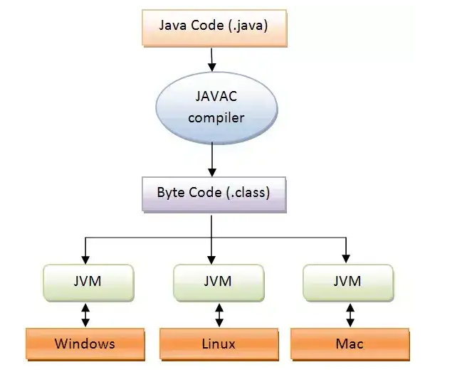

---

### JDK and JRE Setup (1)


---

<style scoped>section{ font-size: 25px; }</style>

### JDK and JRE Setup (2)

- **JDK** (Java Development Kit) is a Kit that provides the environment to **develop and execute(run)** the Java program. JDK is a kit(or package) that includes two things

  - Development Tools(to provide an environment to develop your java programs)
  - JRE (to execute your java program).

- **JRE** (Java Runtime Environment) is an installation package that provides an environment to **only run(not develop)** the java program(or application)onto your machine. JRE is only used by those who only want to run Java programs that are end-users of your system.

- [**JVM** (**Java Virtual Machine)**](https://www.geeksforgeeks.org/jvm-works-jvm-architecture/) is a very important part of both JDK and JRE because it is contained or inbuilt in both. Whatever Java program you run using JRE or JDK goes into JVM and JVM is responsible for executing the java program line by line, hence it is also known as an [**i\*\*\***nterpreter\*\*\*](https://www.geeksforgeeks.org/compiler-vs-interpreter-2/)**.**

---

- [Difference between JDK, JRE, JVM - TutorialAndExample](https://www.tutorialandexample.com/difference-between-jdk-jre-jvm)

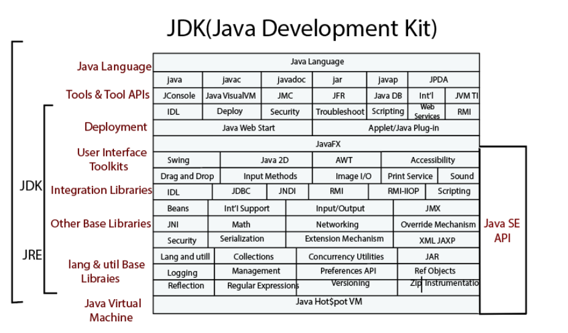

---

<style scoped>section{ font-size: 25px; }</style>

### System Environments and Paths for Java (1)


---

### System Environments and Paths for Java (2)

- Select path variable (JDK should be set there)

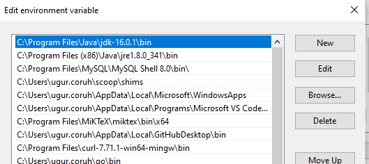

---

### System Environments and Paths for Java (3)

- JAVA_HOME also should be set


---

<style scoped>section{ font-size: 25px; }</style>

### Netbeans (Java) (1)

- Open New Project -> Java Project


---

<style scoped>section{ font-size: 25px; }</style>

### Netbeans (Java) (2)


---

<style scoped>section{ font-size: 25px; }</style>

### Netbeans (Java) (3)

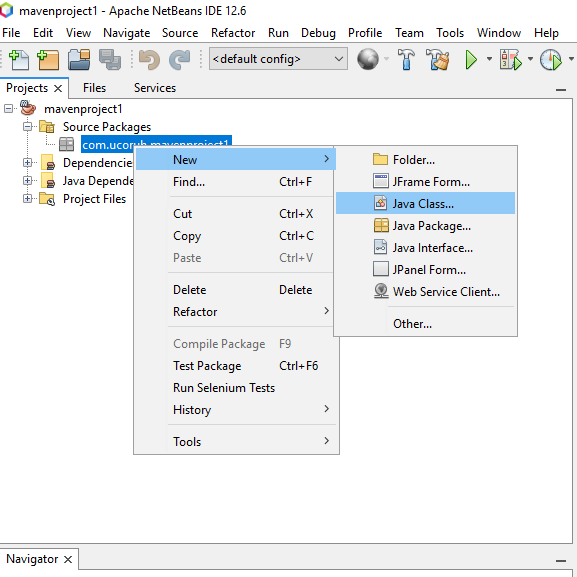

---

<style scoped>section{ font-size: 25px; }</style>

### Netbeans (Java) (4)

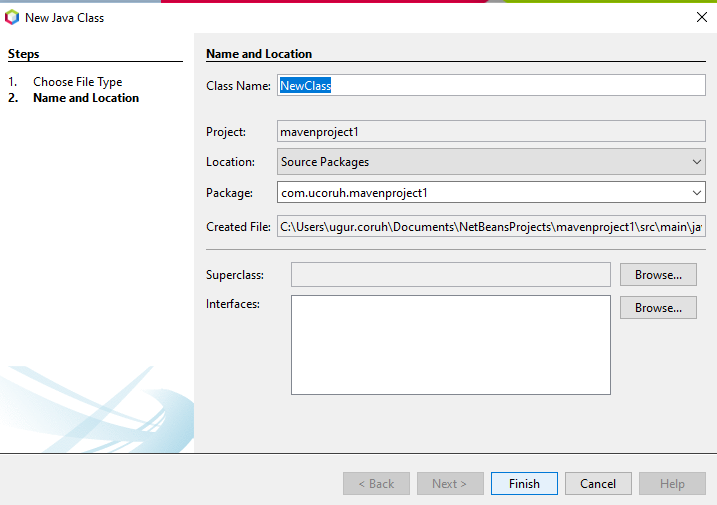

---

<style scoped>section{ font-size: 25px; }</style>

### Netbeans (Java) (5)

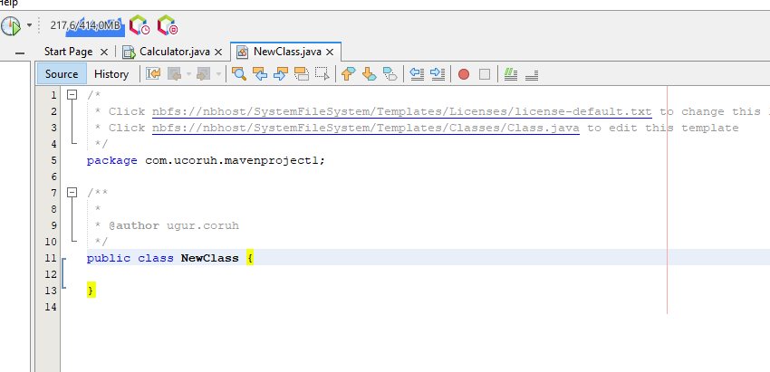

---

<style scoped>section{ font-size: 25px; }</style>

### Netbeans (Java) (6)

Update code and run


```java
/*
 * Click nbfs://nbhost/SystemFileSystem/Templates/Licenses/license-default.txt to change this license
 * Click nbfs://nbhost/SystemFileSystem/Templates/Classes/Class.java to edit this template
 */
package com.ucoruh.mavenproject1;

/**
 *
 * @author ugur.coruh
 */
public class NewClass {

static                  //static block
{
    System.out.println("Static block");
}

public static void main(String args[])  //static method
{
    System.out.println("Static method");
}

}

```

---

<style scoped>section{ font-size: 25px; }</style>

### Netbeans (Java) (7)


---

<style scoped>section{ font-size: 25px; }</style>

### Netbeans (Java) (8)


---

<style scoped>section{ font-size: 25px; }</style>

### Netbeans (Java) (9)

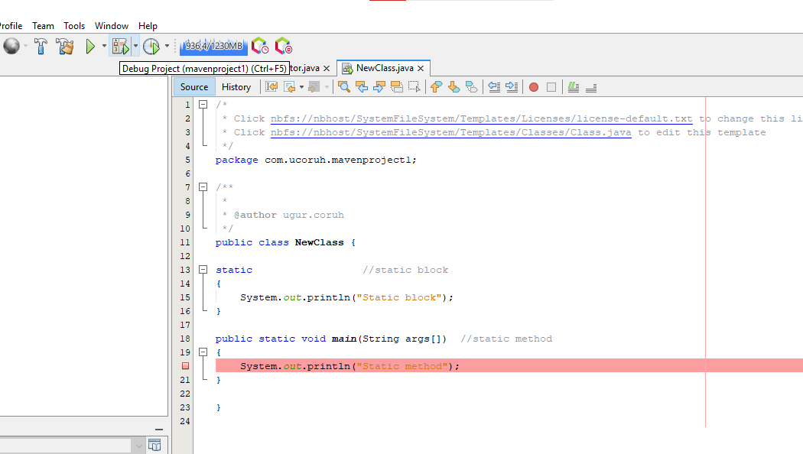

---

<style scoped>section{ font-size: 25px; }</style>

### Netbeans (Java) (10)


---

<style scoped>section{ font-size: 25px; }</style>

### Eclipse (Java) (1)

- Select File -> New Project

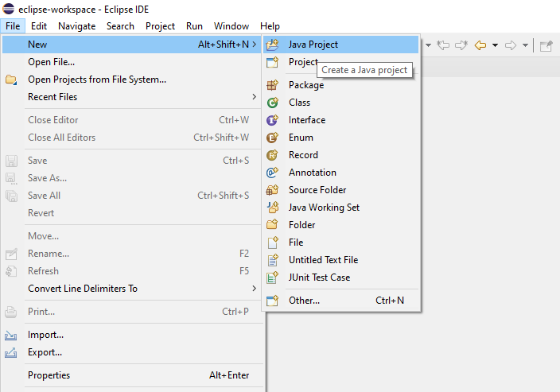

---

<style scoped>section{ font-size: 25px; }</style>

### Eclipse (Java) (2)

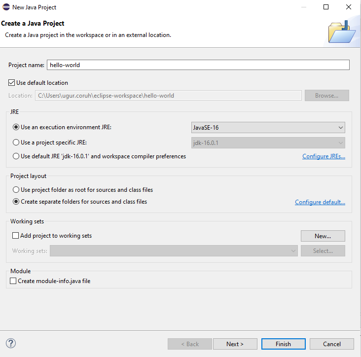

---

<style scoped>section{ font-size: 25px; }</style>

### Eclipse (Java) (3)


---

<style scoped>section{ font-size: 25px; }</style>

### Eclipse (Java) (4)


---

<style scoped>section{ font-size: 25px; }</style>

### Eclipse (Java) (5)


---

<style scoped>section{ font-size: 25px; }</style>

### Eclipse (Java) (6)

- Update source

```java
package ucoruh;

public class HelloClass {

	static {
		System.out.println("Static Block");
	}

	public static void main(String[] args) {
		// TODO Auto-generated method stub
	    System.out.println("Static Method");

	}

}
```

---

<style scoped>section{ font-size: 25px; }</style>

### Eclipse (Java) (7)


---

<style scoped>section{ font-size: 25px; }</style>

### Eclipse (Java) (8)

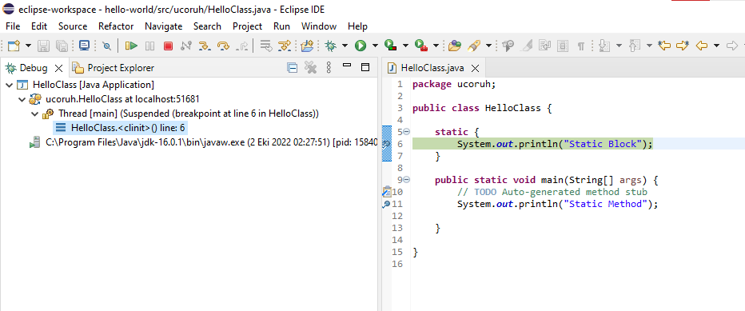

---

<style scoped>section{ font-size: 25px; }</style>

### Intellij Idea (Jet Brains) (Java)

- [Download IntelliJ IDEA: The Capable & Ergonomic Java IDE by JetBrains](https://www.jetbrains.com/idea/download/#section=windows)

  - Select Community Version or Student Ultimate Version


---

<style scoped>section{ font-size: 25px; }</style>

### VSCode (Java)

- Java Extension Run&Debug Java Files


---

<style scoped>section{ font-size: 25px; }</style>

### Notepad++ (Java)

- [How to Compile and Run Java Programs Using Notepad++](https://www.wikihow.com/Compile-and-Run-Java-Program-by-Notepad)

---

<style scoped>section{ font-size: 25px; }</style>

### Cmake (Java)

- [UseJava &mdash; CMake 3.24.2 Documentation](https://cmake.org/cmake/help/latest/module/UseJava.html)

- [GitHub - ptitpoulpe/cmake-swig-java-example: An example of combining cmake, swig and java](https://github.com/ptitpoulpe/cmake-swig-java-example)

---

<style scoped>section{ font-size: 25px; }</style>

# C# Environment and Development

---

<style scoped>section{ font-size: 25px; }</style>

### Visual Studio Community Edition (C#)

//TODO//


---

<style scoped>section{ font-size: 25px; }</style>

### Notepad++ (C#)

- This use command-line utilities for csharp, nppexec should be configured for this utility.

- [Compiling/Executing a C# Source File in Command Prompt - Stack Overflow](https://stackoverflow.com/questions/553143/compiling-executing-a-c-sharp-source-file-in-command-prompt)

```bash
c:\windows\Microsoft.NET\Framework\v3.5\
```

```bash
c:\windows\Microsoft.NET\Framework\v3.5\bin\csc.exe
            /t:exe /out:MyApplication.exe MyApplication.cs  ...
```

---

<style scoped>section{ font-size: 25px; }</style>

### Cmake (C#)

- [GitHub - crud89/DotNetWithCMake: Your swiss army knife for creating .NET assemblies with CMake and integrating unmanaged code.](https://github.com/crud89/DotNetWithCMake)

---

<style scoped>section{ font-size: 25px; }</style>

### Common Tools and Platforms

---

<style scoped>section{ font-size: 25px; }</style>

### Fatih Kalem


https://cdnvideo.eba.gov.tr/fatihkalem/fatihkalem_portable.zip

https://cdnvideo.eba.gov.tr/fatihkalem/fatihkalem_setup.exe


---

<style scoped>section{ font-size: 25px; }</style>

### Notepad++ (Notepad for Source Code)

[Downloads | Notepad&#43;&#43;](https://notepad-plus-plus.org/downloads/)

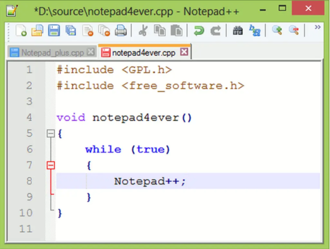

---

<style scoped>section{ font-size: 25px; }</style>

### HxD (Hex Editor)


[HxD - Freeware Hex Editor and Disk Editor | mh-nexus](https://mh-nexus.de/en/hxd/)


---

<style scoped>section{ font-size: 25px; }</style>

### MarktextApp (Markdown Syntax Editor)


- https://marktext.app/
- https://github.com/marktext/marktext/releases
- Download latest version
  - https://github.com/marktext/marktext/releases/tag/v0.17.1


---

<style scoped>section{ font-size: 25px; }</style>

### Cygwin (Linux environment for Windows)


- https://www.cygwin.com/


---

<style scoped>section{ font-size: 25px; }</style>

### Dependency Walker (32-bit or 64-bit Windows module dependency checker)


- https://www.dependencywalker.com/

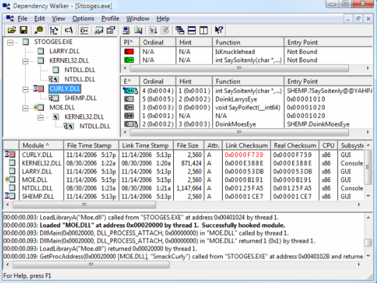

---

<style scoped>section{ font-size: 25px; }</style>

### Doxygen (Code Documentation)


[Doxygen: Doxygen](https://www.doxygen.nl/index.html)


---

<style scoped>section{ font-size: 25px; }</style>

### Sonarlint (Code Quality and Code Security Extension)


https://www.sonarlint.org/

---

<style scoped>section{ font-size: 25px; }</style>

### Codepen.io (online code sharing)


- https://codepen.io/

- CodePen is a social development environment. At its heart, it allows you to write code in the browser, and see the results of it as you build.

- A useful and liberating online code editor for developers of any skill, and particularly empowering for people learning to code. We focus primarily on front-end languages like HTML, CSS, JavaScript, and preprocessing syntaxes that turn into those things


---

<style scoped>section{ font-size: 25px; }</style>

### Codepen.io (online code sharing)

- Credit Card Sample on Codepen
  - https://codepen.io/quinlo/pen/YONMEa
- Checkout trends https://codepen.io/trending

---

<style scoped>section{ font-size: 25px; }</style>

### Codeshare.io (real-time code sharing)

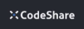

- https://codeshare.io/

- Share Code in Real-time with Developers, An online code editor for interviews, troubleshooting, teaching & more…

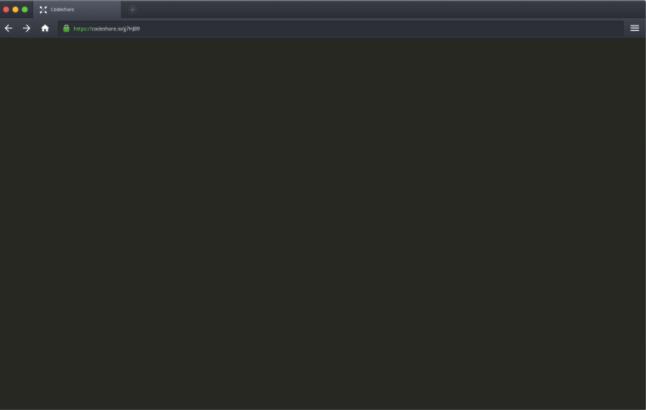

---

<style scoped>section{ font-size: 25px; }</style>

### Codebeautify.org (online data conversion tools)


- Has several tools for developers (Code Formatter, JSON Beautifier, XML Viewer, Hex Converters and more...)
- https://codebeautify.org/

---

<style scoped>section{ font-size: 25px; }</style>

### AsciiFlow.com (ASCII drawing tool)

- Asciflow provides ascii based drawings that you can copy directly to textfiles and source codes. Visit the following link

  - https://asciiflow.com/

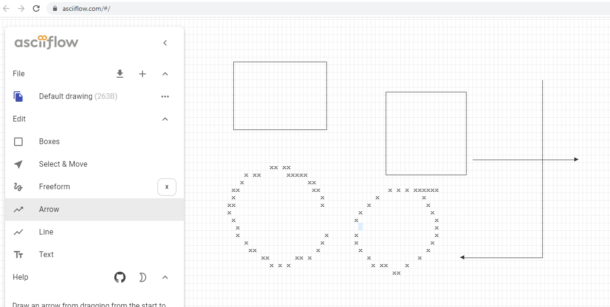

---

<style scoped>section{ font-size: 25px; }</style>

### Freemind (opensource mindmap application)

- Freemind is open source java based desktop mindmap application. Can export files to several formats

  - [Main Page - FreeMind](https://freemind.sourceforge.net/wiki/index.php/Main_Page)

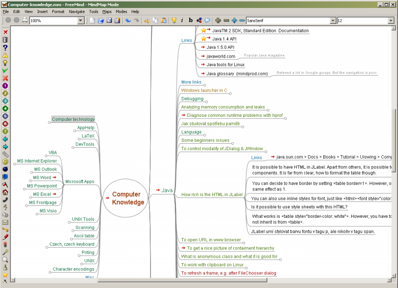

---

<style scoped>section{ font-size: 25px; }</style>

#### Mockup Designers

- Mockflow

  - [Signup - MockFlow](https://mockflow.com/signup/)

- Wireflow

  - https://wireflow.co/

---

<style scoped>section{ font-size: 25px; }</style>

### PlantUML (software designer)

- Text based designer for software engineers

  - https://plantuml.com/

- 

- Also visit course notes that related to plantuml [CE204 Object-Oriented Programming - RTEU C204 Object Oriented Programming Course Notes](https://ucoruh.github.io/ce204-object-oriented-programming/week-5/ce204-week-5/)

---

<style scoped>section{ font-size: 25px; }</style>

### Drawio (drawing tool)

- Online and Offline Drawing Tool

  - https://app.diagrams.net/

- Offline Installer

  - [Releases · jgraph/drawio-desktop · GitHub](https://github.com/jgraph/drawio-desktop/releases/)

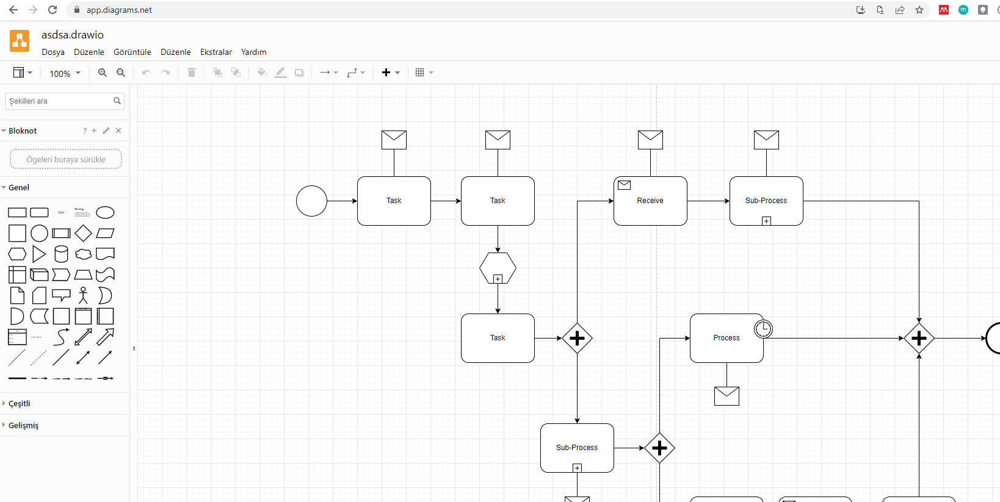

---

<style scoped>section{ font-size: 25px; }</style>

### Putty (Remote Connection)

- Commonly use for SSH connection


---

- We can run a SSH server with MobaXterm and can connect to same computer with Putty.


---


---


---

## Download file over SSH Protocol

- [How to Download and Upload Files over SSH &ndash; TecAdmin](https://tecadmin.net/download-file-using-ssh/)

Here are some useful examples for downloading files from the remote system over SSH protocol.

- This will connect to example.com server with user “**username**” and copy the **/backup/file.zip** file to local system directory **/local/dir**. To use theis command replace the values as per your environment.

  ```
  scp username@example.com:/backup/file.zip /local/dir
  ```

- If the SSH is running on a non-standard port, You can specify the port using `-P` option with SCP command.

  ```
  scp -P 2222 username@example.com:/backup/file.zip /local/dir
  ```

- If your remote server required a private key to connect server, You can use `-i` followed by a private key file path to connect your server using the SCP command. This can be helpful for AWS servers.

  ```
  scp -i private_key.pem username@example.com:/backup/file.zip /local/dir
  ```

---

## Upload file using SSH

You can also upload files to the remote server using SSH protocol using the SCP command. Use the following example command for uploading files to the SSH server.

```
scp file.zip username@example.com:/remote/dir
```

Similarity you can use **-P** switch to define port of the SSH server and **-i** to define private key for the user authentication.

---

- Also you can use SSH tunnels for remote code development

  - [Developing on Remote Machines using SSH and Visual Studio Code](https://code.visualstudio.com/docs/remote/ssh)

  - [Visual Studio Code Server](https://code.visualstudio.com/docs/remote/vscode-server)

---

---

<style scoped>section{ font-size: 25px; }</style>

### MobaXterm (Remote Connection)

- Multip Purpose Remote Connection Toolkit


---


---


---

<style scoped>section{ font-size: 25px; }</style>

### Teamviewer (Remote Connection)

- Remote connection tool

  - [TeamViewer – Uzaktan Destek, Uzaktan Erişim, Hizmet Masası, Çevrimiçi İşbirliği ve Toplantılar](https://www.teamviewer.com/tr/)


---

### AnyDesk

- Remote connection tool

  - [The Fast Remote Desktop Application – AnyDesk](https://anydesk.com/en)


---

<style scoped>section{ font-size: 25px; }</style>

### Paletton.com and Colorhunt.co (Color Chooser)

- Generates color pallettes and sample usages

  - [Paletton - The Color Scheme Designer](https://paletton.com/#uid=1000u0kllllaFw0g0qFqFg0w0aF)

  - https://colorhunt.co/

  - Also check [Colors Tutorial](https://www.w3schools.com/colors/)

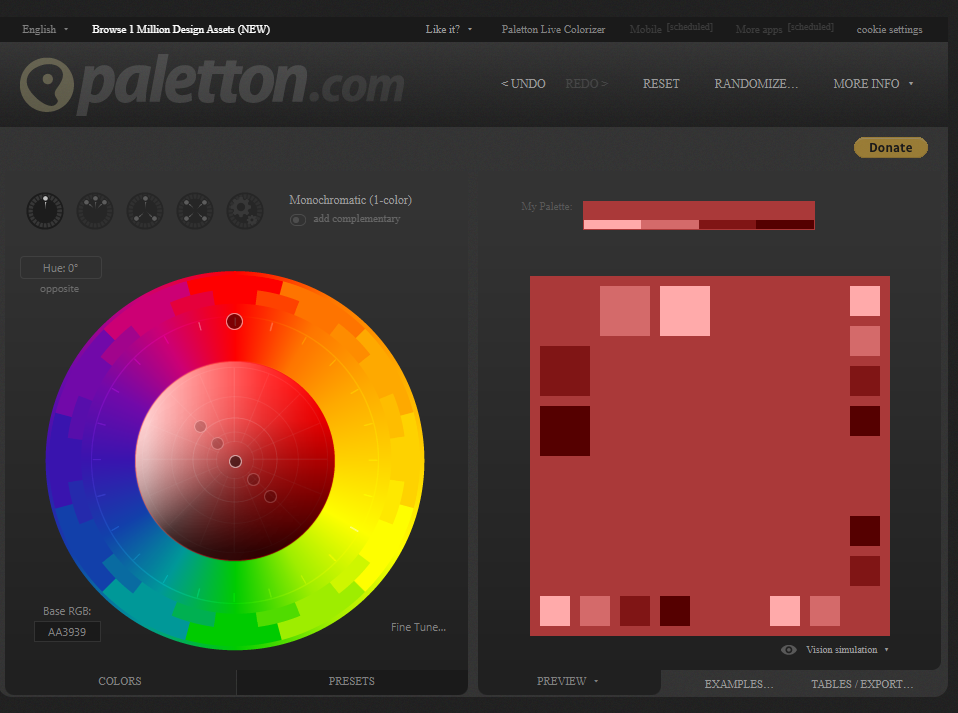

---


---

<style scoped>section{ font-size: 25px; }</style>

### Understand (Static Code Analysis)

- https://emenda.com/scitools-understand/


---


---

<style scoped>section{ font-size: 25px; }</style>

### JD Project (Java Decompiler)

- Java Decompiler for Jar and Class Files, If code is not obfuscated it recover source code from compiled files. Just drag and drop files to GUI

  - http://java-decompiler.github.io/

  - You can use it standalone app or with eclipse

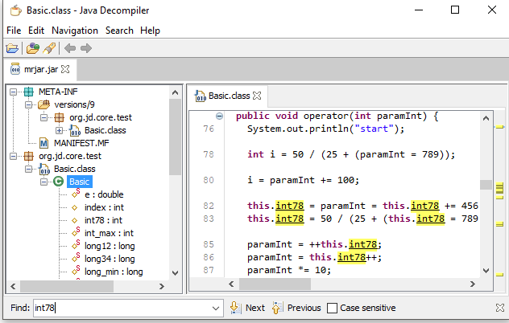

---

<style scoped>section{ font-size: 25px; }</style>

### Cutter (Multi-Platform Reverse Engineering Tool)

- Cutter's goal is to be an advanced FREE and open-source reverse-engineering platform while keeping the user experience at mind. Cutter is created by reverse engineers for reverse engineers.

- https://cutter.re/

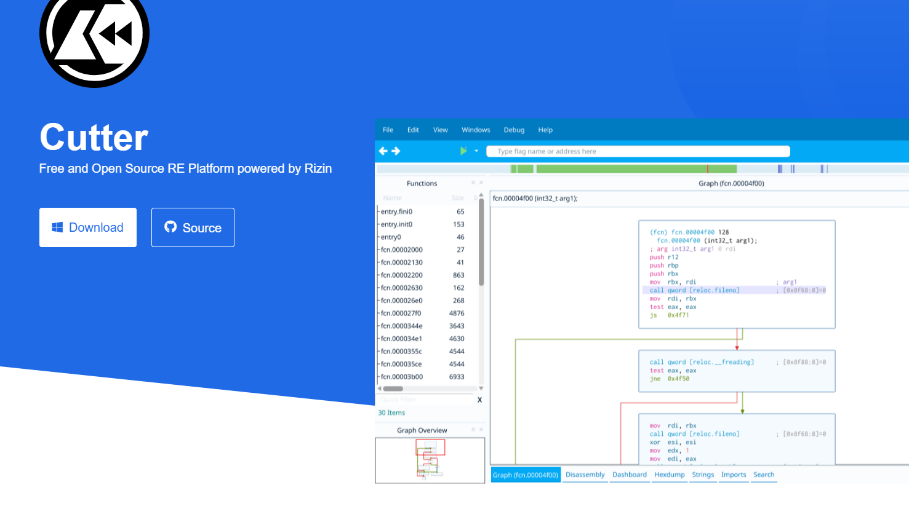

---

<style scoped>section{ font-size: 25px; }</style>

### IDA Pro / Freeware (Native Reverse Engineering Tool)

- IDA Pro as a disassembler is capable of creating maps of their execution to show the binary instructions that are actually executed by the processor in a symbolic representation (assembly language). Advanced techniques have been implemented into IDA Pro so that it can generate assembly language source code from machine-executable code and make this complex code more human-readable.

---

<style scoped>section{ font-size: 25px; }</style>

### IDA Pro / Freeware (Native Reverse Engineering Tool)

- [Hex Rays - State-of-the-art binary code analysis solutions](https://hex-rays.com/ida-pro/)


---

<style scoped>section{ font-size: 25px; }</style>

### IDA Pro / Freeware (Native Reverse Engineering Tool)


---

<style scoped>section{ font-size: 25px; }</style>

### Code Visualization (Python, C , C++ , Java)

- This coding tutor tool helps you learn Python, JavaScript, C, C++, and Java by visualizing code execution.

  - https://pythontutor.com/

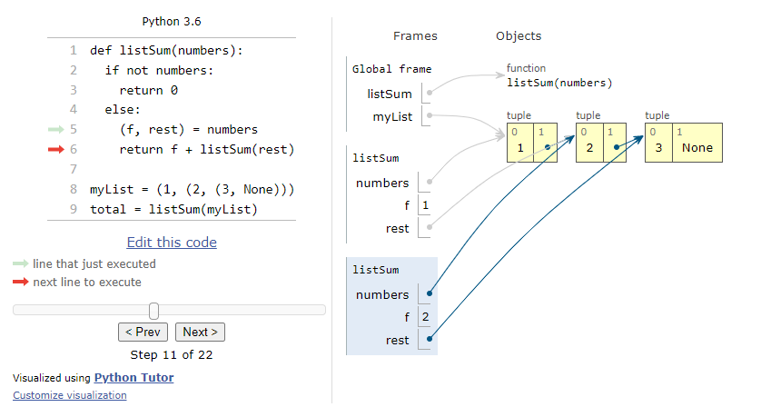

---

<style scoped>section{ font-size: 25px; }</style>

### Assembly of C Code

- Multilanguage supported. Convert source code to assembly codes

  - https://godbolt.org/

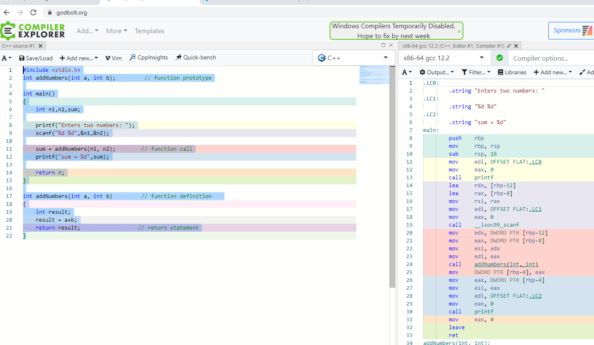

---

<style scoped>section{ font-size: 25px; }</style>

### Mobile Device Screen Sharing for Demo

- Show USB or Wifi connected Mobile Device Screen on PC and Provide Controls

  - [GitHub - Genymobile/scrcpy: Display and control your Android device](https://github.com/Genymobile/scrcpy)

  - Run `scrcpy` for single mobile phone.

  - [Open Source Project - Scrcpy now works wirelessly](https://www.genymotion.com/blog/open-source-project-scrcpy-now-works-wirelessly/)

---

<style scoped>section{ font-size: 25px; }</style>

### Travis-CI

- Travis-CI is a continues integration platform

- Travis-CI free option removed for this reason, its not in our scope.

- It uses Travis.yml files for actions.

---

<style scoped>section{ font-size: 25px; }</style>

### AppVeyor

- Another CI platform it has free option for public builds.

  - https://www.appveyor.com

  - [GitHub - Kimserey/hello-world-nuget](https://github.com/Kimserey/hello-world-nuget)

  - [hello-world-nuget/appveyor.yml at master · Kimserey/hello-world-nuget · GitHub](https://github.com/Kimserey/hello-world-nuget/blob/master/appveyor.yml)

---

<style scoped>section{ font-size: 25px; }</style>

### Jenkins

- Self-hosted solution for CI operations, Has integration with Github and several platforms.

  - https://www.jenkins.io/

  - https://www.jenkins.io/doc/pipeline/tour/hello-world/

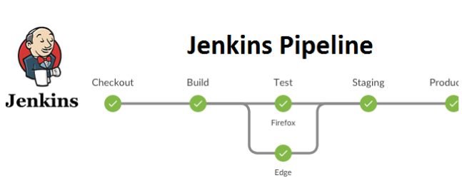

---

<style scoped>section{ font-size: 25px; }</style>

### Jenkins


---

<style scoped>section{ font-size: 25px; }</style>

### Jenkins

- https://www.jenkins.io/solutions/github/


---

<style scoped>section{ font-size: 25px; }</style>

### Vagrant

- Vagrant is a tool for building and managing virtual machine environments in a single workflow. With an easy-to-use workflow and focus on automation, Vagrant lowers development environment setup time, increases production parity, and makes the "works on my machine" excuse a relic of the past.

  - https://www.vagrantup.com/

- Setup Development Environment with Vagrant

  - [Setting Up Development Environment Using Vagrant - Edureka](https://www.edureka.co/blog/development-environment-using-vagrant/)

  - [development-environment/Vagrantfile at master · gantsign/development-environment · GitHub](https://github.com/gantsign/development-environment/blob/master/Vagrantfile)

---

<style scoped>section{ font-size: 25px; }</style>

### Docker / Docker Compose / Kubernetes (1)

- Docker takes away repetitive, mundane configuration tasks and is used throughout the development lifecycle for fast, easy and portable application development – desktop and cloud.

  - https://www.youtube.com/watch?v=nBwJm0onzeo&ab_channel=GaryExplains Dockerfile
  - https://devopedia.org/docker

- DockerHub

- Docker Compose Yaml

- Dockerrun.aws.json (AWS)

---

<style scoped>section{ font-size: 25px; }</style>

### Docker / Docker Compose / Kubernetes (2)


---

<style scoped>section{ font-size: 25px; }</style>

### Docker / Docker Compose / Kubernetes (3)


---

<style scoped>section{ font-size: 25px; }</style>

### Docker / Docker Compose / Kubernetes (4)

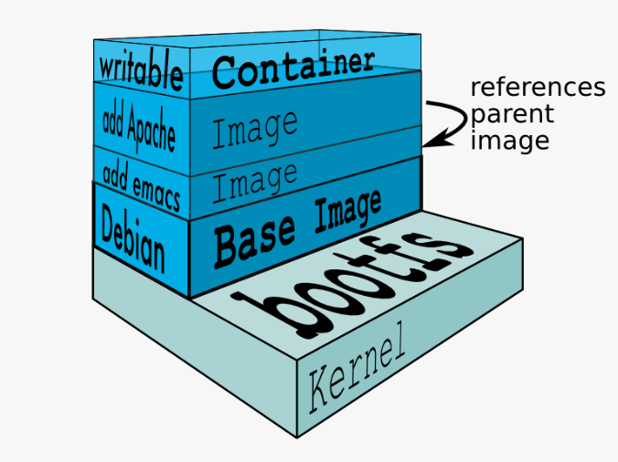

---

<style scoped>section{ font-size: 25px; }</style>

### Docker / Docker Compose / Kubernetes (5)

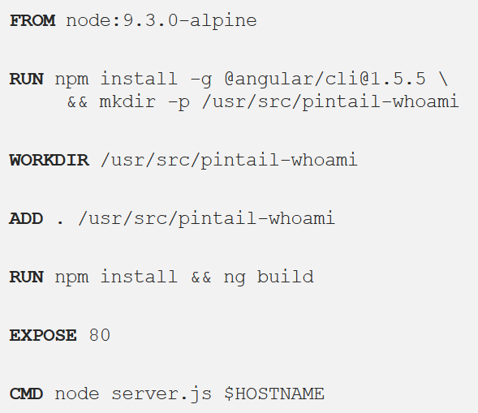

---

<style scoped>section{ font-size: 25px; }</style>

### Docker / Docker Compose / Kubernetes (6)


---

<style scoped>section{ font-size: 25px; }</style>

### Nuget Packages (1)

- https://www.nuget.org/packages

- [What is NuGet and what does it do? | Microsoft Learn](https://learn.microsoft.com/en-us/nuget/what-is-nuget)


---

<style scoped>section{ font-size: 25px; }</style>

### NuGet Tools (2)

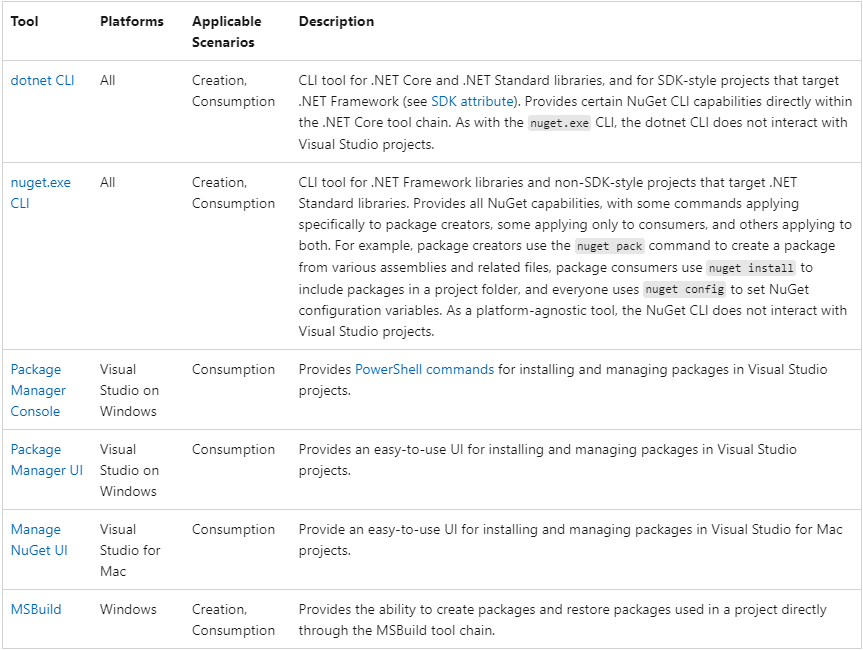

---

<style scoped>section{ font-size: 25px; }</style>

## Managing dependencies (3)

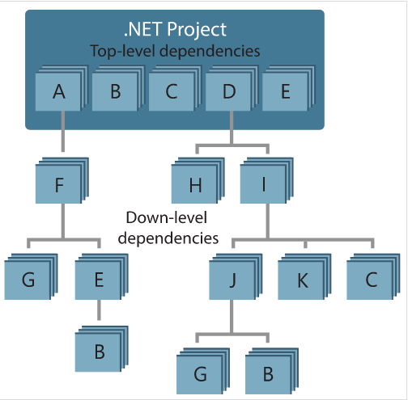

---

<style scoped>section{ font-size: 25px; }</style>

## Tracking references and restoring packages (4)


---

<style scoped>section{ font-size: 25px; }</style>

### SCV Cryptomanager

- SCV Crypto Manager has several tools for cryptographic operations.
  - https://cryptomanager.com/download.php

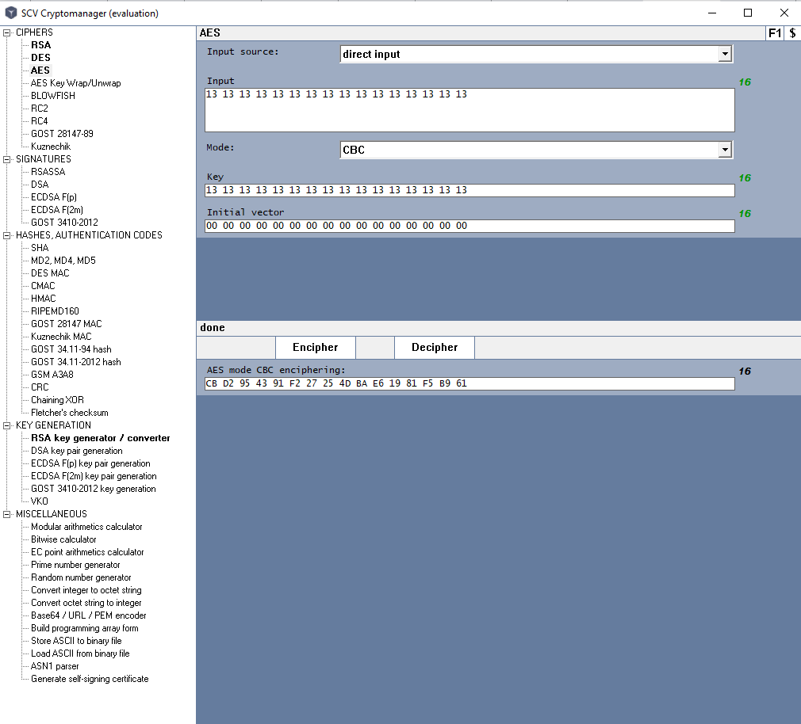

---

<style scoped>section{ font-size: 25px; }</style>

### Addario CryptoBench

- CryptoBench can be used for hash and symmetric asymmetric encryption-decryption operations.
  - [CryptoBench Download Page](http://www.addario.org/cryptobench/)
  - http://www.addario.org/files/CryptoBench%20v1.0.1.zip


---

<style scoped>section{ font-size: 25px; }</style>

### Raymond's MD5 & SHA Checksum Utility

- Hash Calculation Utility

- [MD5 &amp; SHA Checksum Utility | Raymond's WordPress](https://raylin.wordpress.com/downloads/md5-sha-1-checksum-utility/)


---

<style scoped>section{ font-size: 25px; }</style>

### SlavaSoft HashCalc

- [SlavaSoft HashCalc - Hash, CRC, and HMAC Calculator](https://www.slavasoft.com/hashcalc/)


---

<style scoped>section{ font-size: 25px; }</style>

### Portable PGP

- Portable PGP uses for the generation of PGP keys to transfer files securely via e-mail or other channels. You can encrypt or sign your documents with this tool then the receiver can open or verify your e-mail.

- https://ppgp.sourceforge.net/

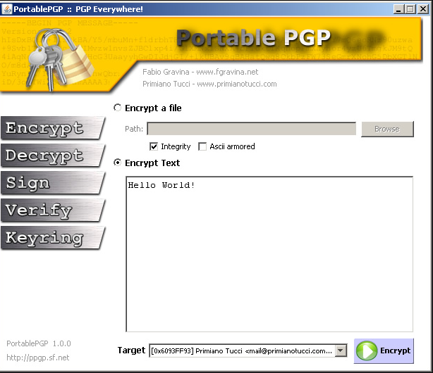

---

<style scoped>section{ font-size: 25px; }</style>

### Online Programming Envoriments

- Hackerrank

  - https://www.hackerrank.com/

- CS50 Sandbox

  - https://sandbox.cs50.io/

- Programiz C Online Complier

  - [Online C Compiler](https://www.programiz.com/c-programming/online-compiler/)

---

$$
End-Of-Week-2
$$

